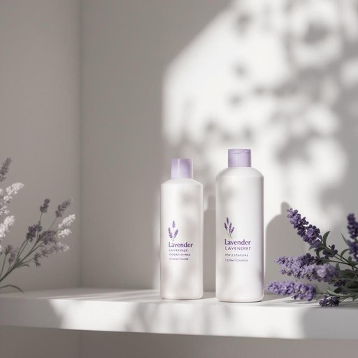

# shampoo

<h1 style="font-size: 2.5em; font-weight: 300; letter-spacing: 2px; margin: 0; color: #2c3e50;">
/ʃæmˈpu/
</h1>

---

---

## 例句

Could you please pass me the shampoo that's next to the conditioner on the bathroom shelf, the one with the lavender scent that Mum bought last week, because I think I’ve almost run out and need to wash my hair before dinner?

*Could(/kʊd/) you(/ju/) please(/pliz/) pass(/pæs/) me(/mi/) the(/ðə/) shampoo(/ʃæmˈpu/) that's(/ðæts/) next(/nɛkst/) to(/tɪ/) the(/ðə/) conditioner(/kənˈdɪʃənər/) on(/ɔn/) the(/ðə/) bathroom(/ˈbæθˌrum/) shelf,(/ʃɛlf,/) the(/ðə/) one(/wən/) with(/wɪθ/) the(/ðə/) lavender(/ˈlævəndər/) scent(/sɛnt/) that(/ðət/) Mum(/məm/) bought(/bɔt/) last(/læst/) week,(/wik,/) because(/bɪˈkəz/) I(/aɪ/) think(/θɪŋk/) I’ve(/i’ve*/) almost(/ˈɔlˌmoʊst/) run(/rən/) out(/aʊt/) and(/ənd/) need(/nid/) to(/tɪ/) wash(/wɑʃ/) my(/maɪ/) hair(/hɛr/) before(/ˌbiˈfɔr/) dinner?(/ˈdɪnər?/)*

**翻译：** 你能把浴室架子上紧挨护发素放着的那瓶洗发水递给我吗？就是上周妈妈买的那款薰衣草香型的，因为我觉得快用完了，晚饭前需要洗头。

---

## 解释

英语单词“shampoo”作为名词在家居生活用品语境中，指的是一种用于清洁头发的液体清洁剂，通常在洗发时使用，适用于家庭浴室、理发店等场合。英语学习者在使用“shampoo”作名词时应注意其不可数用法，如“some shampoo”表示一些洗发水，若强调品牌或类型则可用复数形式“shampoos”；常见搭配包括“hair shampoo”（洗发水）、“anti-dandruff shampoo”（去屑洗发水）、“shampoo bottle”（洗发水瓶）等，表达时也常与动词“use”（使用）、“apply”（涂抹）、“rinse off”（冲洗）等连用。该词源自印地语“chāmpo”（按摩、揉捏），19世纪初由英国殖民地引入英语，最初指头皮按摩，后演变为特指清洁头发的液体。中文中“shampoo”准确译为“洗发水”，强调其作为洗头用液体清洁剂的功能，需区分于“洗发膏”或“洗发露”等细分类别。该单词在日常生活语境中无褒贬色彩，属于中性词汇，文化上反映了西方生活方式中个人卫生及美容护理的普及。

---

<small style="color: #999; font-size: 0.9em;">2025-07-27 09:14:04</small>

