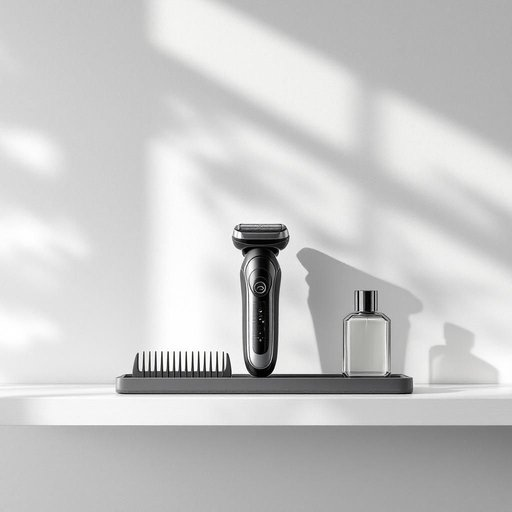

# shaver

<h1 style="font-size: 2.5em; font-weight: 300; letter-spacing: 2px; margin: 0; color: #2c3e50;">
/ˈʃeɪvər/
</h1>

---

---

## 例句

After accidentally knocking over the electric kettle, I realised that the bathroom shelf was overcrowded with toiletries, so I carefully rearranged the items—placing the shaver next to the aftershave and the comb, both of which had been cluttered together for weeks—to create a more organised space that would make my morning routine quicker and less stressful.

*After(/ˈæftər/) accidentally(/ˌæksəˈdɛnəli/) knocking(/ˈnɑkɪŋ/) over(/ˈoʊvər/) the(/ðə/) electric(/ɪˈlɛktrɪk/) kettle,(/ˈkɛtəl,/) I(/aɪ/) realised(/ˈriəˌlaɪzd/) that(/ðət/) the(/ðə/) bathroom(/ˈbæθˌrum/) shelf(/ʃɛlf/) was(/wɑz/) overcrowded(/ˈoʊvərˌkraʊdɪd/) with(/wɪθ/) toiletries,(/ˈtɔɪlətriz,/) so(/soʊ/) I(/aɪ/) carefully(/ˈkɛrfəli/) rearranged(/riəreɪnʤd/) the(/ðə/) items—placing(/items—placing*/) the(/ðə/) shaver(/ˈʃeɪvər/) next(/nɛkst/) to(/tɪ/) the(/ðə/) aftershave(/ˌæftərˈʃeɪv/) and(/ənd/) the(/ðə/) comb,(/koʊm,/) both(/boʊθ/) of(/əv/) which(/wɪʧ/) had(/hæd/) been(/bɪn/) cluttered(/ˈklətərd/) together(/təˈgɛðər/) for(/fər/) weeks—to(/weeks—to*/) create(/kriˈeɪt/) a(/ə/) more(/mɔr/) organised(/organised*/) space(/speɪs/) that(/ðət/) would(/wʊd/) make(/meɪk/) my(/maɪ/) morning(/ˈmɔrnɪŋ/) routine(/ruˈtin/) quicker(/kˈwɪkər/) and(/ənd/) less(/lɛs/) stressful.(/ˈstrɛsfəl./)*

**翻译：** 不小心打翻了电热水壶后，我意识到浴室的置物架上洗漱用品摆得太拥挤了，于是我小心地重新整理了一番，将剃须刀放在须后水和梳子旁边，后两者已经堆放在一起好几周了，从而营造出一个更整洁的空间，使我的晨间流程更快捷、更轻松。

---

## 解释

英语单词“shaver”作为名词，在家居生活用品的语境中通常指的是剃须刀或电动剃须器，使用场合主要涉及个人日常洁面和理容时剃除脸部胡须。这个词在语法上一般作可数名词，常见搭配有“electric shaver”（电动剃须刀）、“manual shaver”（手动剃须刀）、“shaver blade”（剃刀片）等，英语学习者需注意其与动词“shave”的关系以及复数形式“shavers”的正确使用。词源上，“shaver”源自动词“shave”，原意为“刮、剃”，添加“-er”后缀表示执行该动作的工具或人，这种构词方式符合英语中由动词派生名词的常见规律。在中文语境中，“shaver”准确翻译为“剃须刀”或“电动剃须器”，该词在日常用语中较为中性，不带褒贬色彩，但要注意“shaver”在非正式口语中有时也可以指代“骗子”或“狡猾的人”，因此语境判断十分重要。总体而言，在家居用品领域使用时，“shaver”专指剃须工具，是理容护理中常见且实用的名词。

---

<small style="color: #999; font-size: 0.9em;">2025-07-27 09:14:04</small>

