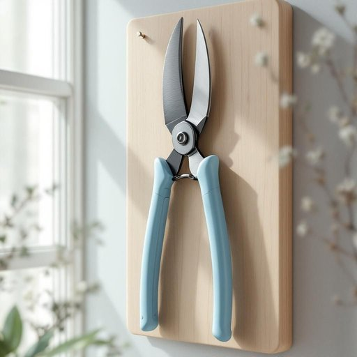

# shears

<h1 style="font-size: 2.5em; font-weight: 300; letter-spacing: 2px; margin: 0; color: #2c3e50;">
/ʃirz/
</h1>

---

---

## 例句

Could you please pass me the shears that are hanging on the pegboard near the window, the ones with the blue handles, so I can trim the overgrown hedges in the garden before it gets too dark?

*Could(/kʊd/) you(/ju/) please(/pliz/) pass(/pæs/) me(/mi/) the(/ðə/) shears(/ʃirz/) that(/ðət/) are(/ər/) hanging(/ˈhæŋɪŋ/) on(/ɔn/) the(/ðə/) pegboard(/ˈpɛgˌbɔrd/) near(/nɪr/) the(/ðə/) window,(/ˈwɪndoʊ,/) the(/ðə/) ones(/wənz/) with(/wɪθ/) the(/ðə/) blue(/blu/) handles,(/ˈhændəlz,/) so(/soʊ/) I(/aɪ/) can(/kən/) trim(/trɪm/) the(/ðə/) overgrown(/ˌoʊvərˈgroʊn/) hedges(/ˈhɛʤɪz/) in(/ɪn/) the(/ðə/) garden(/ˈgɑrdən/) before(/ˌbiˈfɔr/) it(/ɪt/) gets(/gɪts/) too(/tu/) dark?(/dɑrk?/)*

**翻译：** 请将挂在窗户旁钉板上的那把蓝色手柄剪刀递给我，以便我在天黑之前修剪花园中过于茂盛的树篱。

---

## 解释

英语单词“shears”作为名词在家居生活用品语境中，通常指一种用于剪裁较厚材料或物体的大剪刀，尤其常见于园艺用剪刀或理发剪刀。具体使用场合包括修剪花草、修整灌木、剪裁布料或较厚的纸张等，与普通剪刀相比，shears通常尺寸较大，刀刃坚固，便于处理较粗或较硬的材料。英语学习者使用该词时应注意，“shears”通常为复数形式，即使表示一把剪刀，也多用复数，类似于“pants”表示一条裤子；同时搭配常见表达如“garden shears”（园艺剪刀）、“hair shears”（理发剪刀）等，动词形式通常为“use shears”或“cut with shears”。在词源上，“shears”源自古英语“scēara”，与“shear（剪切）”动词同根，体现出“剪切工具”的本义。这一词汇在中文中通常被翻译为“剪刀”或“剪枝剪”，根据具体用途可细化为“园艺剪”、“大剪刀”或“修枝剪”，强调其为大而坚固的剪具。需注意的是，shears本身没有明显的褒贬色彩或特殊文化内涵，属于中性词，主要侧重工具功能的描述。

---

<small style="color: #999; font-size: 0.9em;">2025-07-27 09:14:04</small>

