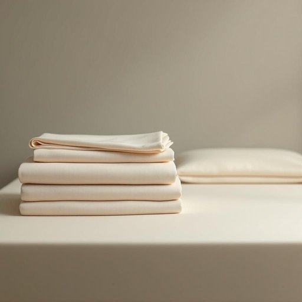

# sheet

<h1 style="font-size: 2.5em; font-weight: 300; letter-spacing: 2px; margin: 0; color: #2c3e50;">
/ʃit/
</h1>

---

---

## 例句

Could you please check if the clean sheet I just put on the bed fits properly, or should I grab the other one from the linen closet that has the slightly thicker fabric and softer texture, which Mum bought last week during the sale?

*Could(/kʊd/) you(/ju/) please(/pliz/) check(/ʧɛk/) if(/ɪf/) the(/ðə/) clean(/klin/) sheet(/ʃit/) I(/aɪ/) just(/ʤɪst/) put(/pʊt/) on(/ɔn/) the(/ðə/) bed(/bɛd/) fits(/fɪts/) properly,(/ˈprɑpərli,/) or(/ər/) should(/ʃʊd/) I(/aɪ/) grab(/græb/) the(/ðə/) other(/ˈəðər/) one(/wən/) from(/frəm/) the(/ðə/) linen(/ˈlɪnən/) closet(/ˈklɑzət/) that(/ðət/) has(/həz/) the(/ðə/) slightly(/sˈlaɪtli/) thicker(/ˈθɪkər/) fabric(/ˈfæbrɪk/) and(/ənd/) softer(/ˈsɔftər/) texture,(/ˈtɛksʧər,/) which(/wɪʧ/) Mum(/məm/) bought(/bɔt/) last(/læst/) week(/wik/) during(/ˈdʊrɪŋ/) the(/ðə/) sale?(/seɪl?/)*

**翻译：** 你能帮我看看我刚铺在床上的床单合适吗？还是我应该去床上用品柜里拿妈妈上周促销时买的那条质地稍厚、手感更柔软的床单？

---

## 解释

英语单词“sheet”在家居生活用品场景中作为名词，主要指床单，即铺在床垫上，供人睡觉时覆盖身体或与被子一同使用的布料。具体使用场合通常是描述卧室环境，比如“change the sheets”（换床单）、“put on the sheet”（铺上床单），此时语境多涉及睡眠卫生或整理床铺。英语学习者需要注意“sheet”作为可数名词时通常用复数形式“sheets”表示一套或多张床单，且搭配常见的固定短语有“bed sheets”（床单）、“fitted sheet”（有弹性边缘的床单，用以包裹床垫）、“flat sheet”（平床单，盖在人体上）等。同时，学习者应区分“sheet”与“blanket”（毯子）或“duvet”（羽绒被）的不同。此外，“sheet”常与动词“change”（更换）、“wash”（洗涤）、“spread”（摊开）搭配。该词源自古英语“scēat”，意指“布片”，由此延伸为各种大片薄布或纸张的含义，在日常用语中延伸至床上用品。中文翻译通常为“床单”，强调的是铺垫在床垫上的大块布料，不含毯子或被子的意思。在中文语境中，“床单”具有中性词汇性质，无褒贬含义，只是卫生活用品的基础部分，文化上也反映了卧室卫生和生活习惯的细节。综上，“sheet”在家居生活中是指床上用品中的基础床单，其语法用法和搭配固定，文化内涵简洁明了，学习时应重视其搭配和词义范围的准确理解。

---

<small style="color: #999; font-size: 0.9em;">2025-07-27 09:14:04</small>

