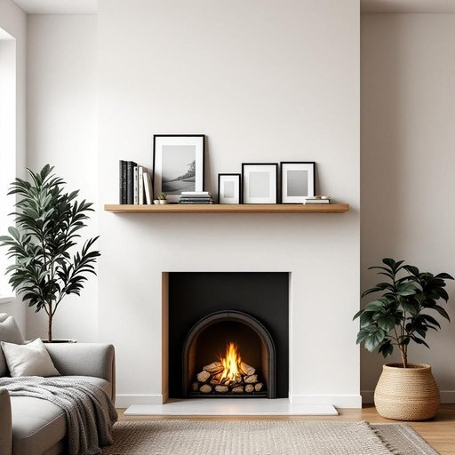

# shelf

<h1 style="font-size: 2.5em; font-weight: 300; letter-spacing: 2px; margin: 0; color: #2c3e50;">
/ʃɛlf/
</h1>

---

---

## 例句

Could you please help me rearrange the books and the photo frames on the living room shelf, which is the one mounted above the fireplace and currently cluttered with various ornaments and old magazines that haven’t been sorted out yet?

*Could(/kʊd/) you(/ju/) please(/pliz/) help(/hɛlp/) me(/mi/) rearrange(/riəreɪnʤ/) the(/ðə/) books(/bʊks/) and(/ənd/) the(/ðə/) photo(/ˈfoʊˌtoʊ/) frames(/freɪmz/) on(/ɔn/) the(/ðə/) living(/ˈlɪvɪŋ/) room(/rum/) shelf,(/ʃɛlf,/) which(/wɪʧ/) is(/ɪz/) the(/ðə/) one(/wən/) mounted(/ˈmaʊnɪd/) above(/əˈbəv/) the(/ðə/) fireplace(/ˈfaɪərˌpleɪs/) and(/ənd/) currently(/ˈkərəntli/) cluttered(/ˈklətərd/) with(/wɪθ/) various(/ˈvɛriəs/) ornaments(/ˈɔrnəmənts/) and(/ənd/) old(/oʊld/) magazines(/ˈmægəˌzinz/) that(/ðət/) haven’t(/haven’t*/) been(/bɪn/) sorted(/ˈsɔrtɪd/) out(/aʊt/) yet?(/jɛt?/)*

**翻译：** 请您帮我整理一下客厅壁炉上方搁板上的书籍和相框，那儿堆满了各种装饰品和未整理的旧杂志，非常凌乱。

---

## 解释

英语单词'shelf'作为名词在家居生活用品语境中，通常指安装在墙上或家具上的平板，用来放置书籍、装饰品、食物或其他物品，常见于书架、储物柜或厨房橱柜中。具体使用场合包括描述房间布置如“a bookshelf with three shelves”（一个有三层搁板的书架），或厨房中储物空间，如“a spice shelf”（调料架）；其语境多为日常生活环境，强调储物和展示功能。英语学习者使用时需注意‘shelf’的复数形式为‘shelves’，属于不规则复数；在搭配中，常见表达如“on the shelf”（放在架子上），也有词组“to put on the shelf”，比喻某事物被搁置不用。此外，‘shelf’常与动词如put, place, assemble搭配，例如“to assemble a shelf”（组装一个搁板）；在语法上作为可数名词使用。词源上，‘shelf’源自古英语“scylfe”，意为突出或突起的水平表面，与现代含义贴合，反映其作为水平平面支撑物的功能。在中文语境中准确翻译为“架子”、“搁板”或“层板”，侧重其实用的置物功能，无特别褒贬或文化色彩，属于中性词汇，广泛应用于描述家居环境中的储物结构和空间布置。

---

<small style="color: #999; font-size: 0.9em;">2025-07-27 09:14:04</small>

