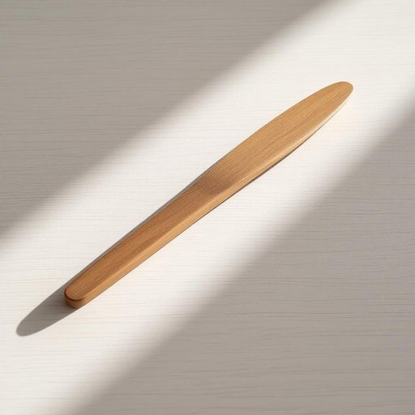

# shoehorn

<h1 style="font-size: 2.5em; font-weight: 300; letter-spacing: 2px; margin: 0; color: #2c3e50;">
/ˈʃuˌhɔrn/
</h1>

---

---

## 例句

Could you please pass me the shoelhorn from the hall table, the one with the polished wooden handle that Grandpa brought back from his trip to Cornwall, because my shoes are far too tight to slip on without it and I want to avoid damaging the leather?

*Could(/kʊd/) you(/ju/) please(/pliz/) pass(/pæs/) me(/mi/) the(/ðə/) shoelhorn(/shoelhorn*/) from(/frəm/) the(/ðə/) hall(/hɔl/) table,(/ˈteɪbəl,/) the(/ðə/) one(/wən/) with(/wɪθ/) the(/ðə/) polished(/ˈpɑlɪʃt/) wooden(/ˈwʊdən/) handle(/ˈhændəl/) that(/ðət/) Grandpa(/ˈgrændˌpɑ/) brought(/brɔt/) back(/bæk/) from(/frəm/) his(/hɪz/) trip(/trɪp/) to(/tɪ/) Cornwall,(/ˈkɔrnwɔl,/) because(/bɪˈkəz/) my(/maɪ/) shoes(/ʃuz/) are(/ər/) far(/fɑr/) too(/tu/) tight(/taɪt/) to(/tɪ/) slip(/slɪp/) on(/ɔn/) without(/wɪˈθaʊt/) it(/ɪt/) and(/ənd/) I(/aɪ/) want(/wɔnt/) to(/tɪ/) avoid(/əˈvɔɪd/) damaging(/ˈdæmɪʤɪŋ/) the(/ðə/) leather?(/ˈlɛðər?/)*

**翻译：** 你能帮我从门厅的桌子上拿一下鞋拔吗？那个带有抛光木柄的，爷爷从他去康沃尔旅行时带回来的。因为我的鞋子太紧了，没有它很难穿进去，我也想避免损伤皮革。

---

## 解释

单词“shohorn”作为名词，在家居生活用品语境中指的是一种帮助穿鞋的小工具，通常为细长而坚硬，形状类似弯曲的薄板，用于将脚后跟顺利塞入鞋内，避免脚后跟被鞋口挤压而变形或磨损。具体使用场合多见于穿较紧或刚买的新鞋时，特别是在需要保持鞋型完整或避免手指接触鞋内部时非常实用。英语学习者在使用“shohorn”时应注意它是可数名词，通常单数形式、复数形式为“shoehorns”，常见表达有“use a shoehorn”，“a metal/plastic shoehorn”，形容材质和用途时多用形容词修饰。此外，shohorn也可以用作动词，意为“硬塞”，但作为名词时不带有贬义，仅表示实物。一些搭配短语如“carry a shoehorn in your bag”或“hand someone a shoehorn”较为常见。词源方面，“shohorn”由“shoe”（鞋）和“horn”（角）组成，最初指用动物角制作的辅助穿鞋工具，这一实物形象沿用至今，现多用塑料或金属材料制成。在中文语境中，“shohorn”准确译为“鞋拔”或“鞋抽”，这两个词均指代同一种工具，其中“鞋拔”更口语化一些，“鞋抽”则较正式，均强调它的功能性，不带特殊褒贬或文化隐含意义，纯粹是一种实用器具的名称。整体来看，“shohorn”是家居生活中常见且实用的小工具，英语使用中无特殊俚语或隐喻色彩，适合初中级及以上英语学习者掌握。

---

<small style="color: #999; font-size: 0.9em;">2025-07-27 09:14:04</small>

