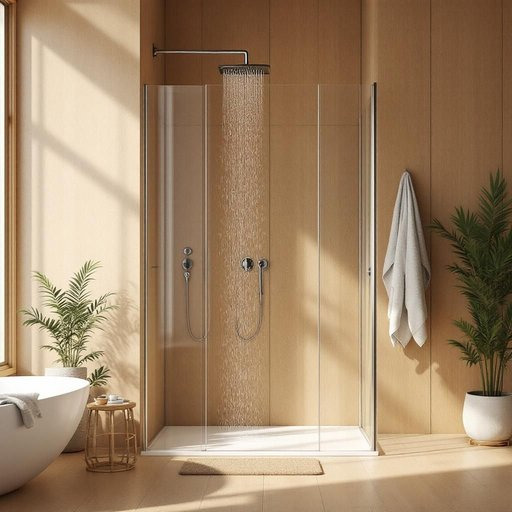

# shower

<h1 style="font-size: 2.5em; font-weight: 300; letter-spacing: 2px; margin: 0; color: #2c3e50;">
/ʃaʊər/
</h1>

---

---

## 例句

After installing the new shower, which features adjustable water pressure and a detachable head, I’ve noticed that not only has my morning routine become more invigorating, but the bathroom’s overall aesthetic has also improved significantly.

*After(/ˈæftər/) installing(/ˌɪnˈstɔlɪŋ/) the(/ðə/) new(/nu/) shower,(/ʃaʊər,/) which(/wɪʧ/) features(/ˈfiʧərz/) adjustable(/əˈʤəstəbəl/) water(/ˈwɔtər/) pressure(/ˈprɛʃər/) and(/ənd/) a(/ə/) detachable(/dɪˈtæʧəbəl/) head,(/hɛd,/) I’ve(/i’ve*/) noticed(/ˈnoʊtɪst/) that(/ðət/) not(/nɑt/) only(/ˈoʊnli/) has(/həz/) my(/maɪ/) morning(/ˈmɔrnɪŋ/) routine(/ruˈtin/) become(/bɪˈkəm/) more(/mɔr/) invigorating,(/ˌɪnˈvɪgərˌeɪtɪŋ,/) but(/bət/) the(/ðə/) bathroom’s(/bathroom’s*/) overall(/ˈoʊvərˌɔl/) aesthetic(/ɛsˈθɛtɪk/) has(/həz/) also(/ˈɔlsoʊ/) improved(/ˌɪmˈpruvd/) significantly.(/sɪgˈnɪfɪkəntli./)*

**翻译：** 安装了这款带有可调节水压和可拆卸花洒的新淋浴设备后，我发现不仅晨间洗浴变得更为振奋精神，浴室的整体美感也显著提升了。

---

## 解释

英语单词“shower”在家居生活用品的语境中作为名词，主要指淋浴装置，即安装在浴室中用来喷洒水以清洁身体的设备，具体使用场合包括家庭卫生间、公共浴室或健身房等洗浴环境。学习者在使用“shower”作为名词时应注意其可数性质，可以用作单数或复数，如“take a shower”（洗澡）或“showers are installed”（安装了淋浴设备）；此外，“shower”常与动词“take”搭配，表达洗澡动作，在表达时也常见短语如“shower room”、“shower head”（喷头）、“shower door”等，语法上也宜区别“shower”作为名词和动词时的不同用法。该词源自中古英语，源自古法语“showere”，意指大量倾泻的水，逐渐演变为现代淋浴的含义。对应中文，“shower”在家居生活用品语境下准确翻译为“淋浴”或“淋浴器”，强调供水装置和洗浴功能，注意区分“shower”与“bath”中文中“浴缸”的差异。此词没有特殊褒贬含义或文化色彩，属于中性词汇，广泛使用且为现代家庭生活中不可缺少的基本卫生设施。

---

<small style="color: #999; font-size: 0.9em;">2025-07-27 09:14:04</small>

