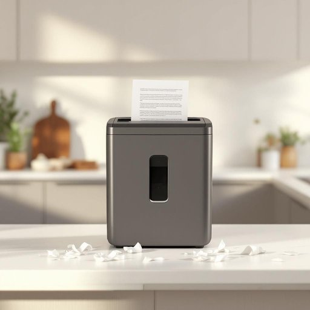

# shredder

<h1 style="font-size: 2.5em; font-weight: 300; letter-spacing: 2px; margin: 0; color: #2c3e50;">
/ʃˈrɛdər/
</h1>

---

---

## 例句

Before you toss those old bank statements in the recycling bin, could you please run them through the shredder on the kitchen counter, which not only destroys sensitive information with its cross-cut blades but also helps keep our household documents safe from identity theft?

*Before(/ˌbiˈfɔr/) you(/ju/) toss(/tɔs/) those(/ðoʊz/) old(/oʊld/) bank(/bæŋk/) statements(/ˈsteɪtmənts/) in(/ɪn/) the(/ðə/) recycling(/riˈsaɪkəlɪŋ/) bin,(/bɪn,/) could(/kʊd/) you(/ju/) please(/pliz/) run(/rən/) them(/ðɛm/) through(/θru/) the(/ðə/) shredder(/ʃˈrɛdər/) on(/ɔn/) the(/ðə/) kitchen(/ˈkɪʧən/) counter,(/ˈkaʊntər,/) which(/wɪʧ/) not(/nɑt/) only(/ˈoʊnli/) destroys(/dɪˈstrɔɪz/) sensitive(/ˈsɛnsɪtɪv/) information(/ˌɪnˌfɔrˈmeɪʃən/) with(/wɪθ/) its(/ɪts/) cross-cut(/cross-cut*/) blades(/bleɪdz/) but(/bət/) also(/ˈɔlsoʊ/) helps(/hɛlps/) keep(/kip/) our(/ɑr/) household(/ˈhaʊsˌhoʊld/) documents(/ˈdɑkjəmənts/) safe(/seɪf/) from(/frəm/) identity(/aɪˈdɛntəˌti/) theft?(/θɛft?/)*

**翻译：** 在您把那些旧银行对账单扔进回收箱之前，能否请您先用厨房台面上的碎纸机处理一下？它不仅能通过交叉切割刀片彻底销毁敏感信息，还能帮助我们保护家庭文件，防止身份盗窃。

---

## 解释

英语单词“shredder”在家居生活用品场景中作为名词，通常指“碎纸机”，即一种用于将纸张切割成细条或碎片以保护隐私和防止信息泄露的电子或机械设备。具体使用场合多见于家庭办公环境或私人住所中，需要处理敏感文件时，如销毁账单、信件或个人资料。英语学习者在使用“shredder”时，应注意它作为名词常搭配的表达如“paper shredder”（碎纸机）、“use a shredder to destroy documents”（使用碎纸机销毁文件），“shredder blades”（碎纸机刀片）等。此外，“shredder”本身是可数名词，复数形式为“shredders”，且动词形式为“shred”，即“撕碎、切碎”。该词源自于动词“shred”，意为撕裂，将词尾加上表示人的名词后缀“-er”构成，意指执行撕碎行为的工具或人。其词根源于中世纪英语“shreden”，含义即为“切成细条”。在中文语境中，“shredder”准确翻译为“碎纸机”，“碎”体现其将纸张分割成小片的功能，“机”则指机械设备，整体表达清晰且无褒贬色彩，属于中性词汇，纯粹指家用或办公设备，无特殊文化内涵或隐喻。因此，理解为家用或办公用来安全销毁文件的工具最为恰当。

---

<small style="color: #999; font-size: 0.9em;">2025-07-27 09:14:04</small>

