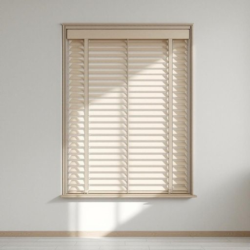

# shutter

<h1 style="font-size: 2.5em; font-weight: 300; letter-spacing: 2px; margin: 0; color: #2c3e50;">
/ˈʃətər/
</h1>

---

---

## 例句

Before the storm hit, she hurried to close every wooden shutter on the house, knowing that those sturdy panels not only protected the windows from debris but also helped to insulate the rooms against the biting wind that was forecasted to last well into the night.

*Before(/ˌbiˈfɔr/) the(/ðə/) storm(/stɔrm/) hit,(/hɪt,/) she(/ʃi/) hurried(/ˈhərid/) to(/tɪ/) close(/kloʊz/) every(/ˈɛvəri/) wooden(/ˈwʊdən/) shutter(/ˈʃətər/) on(/ɔn/) the(/ðə/) house,(/haʊs,/) knowing(/noʊɪŋ/) that(/ðət/) those(/ðoʊz/) sturdy(/ˈstərdi/) panels(/ˈpænəlz/) not(/nɑt/) only(/ˈoʊnli/) protected(/prəˈtɛktɪd/) the(/ðə/) windows(/ˈwɪndoʊz/) from(/frəm/) debris(/dəˈbri/) but(/bət/) also(/ˈɔlsoʊ/) helped(/hɛlpt/) to(/tɪ/) insulate(/ˈɪnsəˌleɪt/) the(/ðə/) rooms(/rumz/) against(/əˈgɛnst/) the(/ðə/) biting(/ˈbaɪtɪŋ/) wind(/wɪnd/) that(/ðət/) was(/wɑz/) forecasted(/ˈfɔrˌkæstɪd/) to(/tɪ/) last(/læst/) well(/wɛl/) into(/ˈɪntu/) the(/ðə/) night.(/naɪt./)*

**翻译：** 暴风雨来临之前，她急忙关闭了房子上所有的木质百叶窗，知道那些坚固的板子不仅能保护窗户免受飞散碎片的撞击，还能隔绝刺骨的寒风，而这种寒风预计将持续到深夜。

---

## 解释

英语单词“shutter”在家居生活用品的语境中作为名词，指的是安装在窗户外侧或内侧，用于遮挡阳光、防风雨或保护隐私的百叶窗或窗扇。它常见于住宅或商业建筑中，尤其是在需要调节光线和通风的情况下使用，如夏季防晒或冬季保暖时关闭窗户百叶窗。英语学习者在使用“shutter”时应注意，其复数形式为“shutters”，且该词通常与动词如“close”（关闭）、“open”（打开）搭配使用，如“close the shutters”，“open the shutters”。此外，“shutter”在摄影领域也有“快门”的含义，但在家居场合多指窗户遮板，因此语境判断尤为重要。词源上，“shutter”源自中古英语，源自古英语“scutter”或“scyttan”，意指关闭或遮挡的装置，反映其保护和遮蔽功能。在中文语境中，“shutter”最准确的翻译为“百叶窗”或“窗扇”，强调其调节光线和保护窗户的作用。该词通常没有褒贬色彩，属于中性词汇，但在描述建筑美学时，有时“shutters”也被视为增添房屋外观风格的装饰元素，具有一定的文化审美价值。

---

<small style="color: #999; font-size: 0.9em;">2025-07-27 09:14:04</small>

