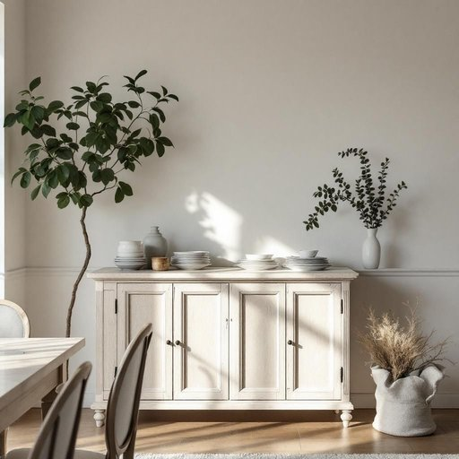

# sideboard

<h1 style="font-size: 2.5em; font-weight: 300; letter-spacing: 2px; margin: 0; color: #2c3e50;">
/sideboard*/
</h1>

---

---

## 例句

After we rearranged the dining room to create more space for guests, I realised that the antique sideboard, which my grandmother had carefully restored over several months, not only provided ample storage for our fine china and silverware but also added a touch of elegance that perfectly complemented the vintage wallpaper and the crystal chandelier hanging overhead.

*After(/ˈæftər/) we(/wi/) rearranged(/riəreɪnʤd/) the(/ðə/) dining(/ˈdaɪnɪŋ/) room(/rum/) to(/tɪ/) create(/kriˈeɪt/) more(/mɔr/) space(/speɪs/) for(/fər/) guests,(/gɛsts,/) I(/aɪ/) realised(/ˈriəˌlaɪzd/) that(/ðət/) the(/ðə/) antique(/ænˈtik/) sideboard,(/sideboard*,/) which(/wɪʧ/) my(/maɪ/) grandmother(/ˈgrændˌməðər/) had(/hæd/) carefully(/ˈkɛrfəli/) restored(/rɪˈstɔrd/) over(/ˈoʊvər/) several(/ˈsɛvərəl/) months,(/mənθs,/) not(/nɑt/) only(/ˈoʊnli/) provided(/prəˈvaɪdɪd/) ample(/ˈæmpəl/) storage(/ˈstɔrɪʤ/) for(/fər/) our(/ɑr/) fine(/faɪn/) china(/ˈʧaɪnə/) and(/ənd/) silverware(/ˈsɪlvərˌwɛr/) but(/bət/) also(/ˈɔlsoʊ/) added(/ˈædɪd/) a(/ə/) touch(/təʧ/) of(/əv/) elegance(/ˈɛləgəns/) that(/ðət/) perfectly(/ˈpərfəktli/) complemented(/ˈkɑmpləˌmɛntɪd/) the(/ðə/) vintage(/ˈvɪntɪʤ/) wallpaper(/ˈwɔlˌpeɪpər/) and(/ənd/) the(/ðə/) crystal(/ˈkrɪstəl/) chandelier(/ʃændəˈlɪr/) hanging(/ˈhæŋɪŋ/) overhead.(/ˈoʊvərˈhɛd./)*

**翻译：** 在我们重新布置餐厅以为客人腾出更多空间后，我意识到那件祖母几个月来精心修复的古董餐边柜，不仅为我们的精美瓷器和银器提供了充足的储藏空间，更为整体环境增添了一抹优雅，完美衬托了复古墙纸和悬挂于上方的水晶吊灯。

---

## 解释

英语单词“sideboard”作为名词，主要指置放在餐厅或客厅中用于存储餐具、餐巾、餐盘及其他餐厅用品的矮柜，通常放置在餐桌旁边以便使用，常见于拥有正式餐厅布置的家庭环境中。学习者在使用“sideboard”时应注意它是可数名词，可以与冠词（a sideboard, the sideboard）连用，常见搭配有“wooden sideboard”（木质矮柜）、“antique sideboard”（古董矮柜）、“sideboard drawers”（矮柜抽屉）等。此外，“sideboard”不仅指家具本身，也可引申指用以摆放餐具的那块空间或区域。该词源自中古英语，最初由“side”加“board”构成，意指靠墙摆放的侧板或桌板，历史上其功能与“buffet”类似，但布局和使用细节有所差异。在中文语境中，“sideboard”通常译作“矮柜”或“餐边柜”，强调其在餐厅中存储和辅助餐桌使用的功能，无明显褒贬含义，但因其多用于正式且较为传统的家庭餐厅布局中，带有一定的典雅和稳重色彩，是家具分类中的专有名称。

---

<small style="color: #999; font-size: 0.9em;">2025-07-27 09:14:04</small>

