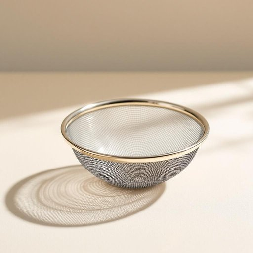

# sieve

<h1 style="font-size: 2.5em; font-weight: 300; letter-spacing: 2px; margin: 0; color: #2c3e50;">
/sɪv/
</h1>

---

---

## 例句

Although the ancient mathematician used a primitive sieve to separate prime numbers from composites, modern algorithms have vastly improved this method, allowing for much faster and more efficient computations in large-scale number theory problems.

*Although(/ˌɔlˈðoʊ/) the(/ðə/) ancient(/ˈeɪnʧənt/) mathematician(/ˌmæθəməˈtɪʃən/) used(/juzd/) a(/ə/) primitive(/ˈprɪmɪtɪv/) sieve(/sɪv/) to(/tɪ/) separate(/ˈsɛpərˌeɪt/) prime(/praɪm/) numbers(/ˈnəmbərz/) from(/frəm/) composites,(/kəmˈpɑzəts,/) modern(/ˈmɑdərn/) algorithms(/ˈælgərˌɪðəmz/) have(/hæv/) vastly(/ˈvæstli/) improved(/ˌɪmˈpruvd/) this(/ðɪs/) method,(/ˈmɛθəd,/) allowing(/əˈlaʊɪŋ/) for(/fər/) much(/məʧ/) faster(/ˈfæstər/) and(/ənd/) more(/mɔr/) efficient(/ɪˈfɪʃənt/) computations(/ˌkɑmpjuˈteɪʃənz/) in(/ɪn/) large-scale(/ˈlɑrʤˌskeɪl/) number(/ˈnəmbər/) theory(/ˈθɪri/) problems.(/ˈprɑbləmz./)*

**翻译：** 尽管古代数学家使用一种原始的筛法来区分质数与合数，现代算法已经极大地改进了这一方法，使得在大规模数论问题中计算速度更快、效率更高。

---

## 解释

英语单词sieve作为名词在家居生活用品的语境中指的是一种带有细孔网状结构的工具，用于过滤或筛分固体颗粒与液体的混合物，常见于厨房中，如筛面粉、滤茶叶或分离杂质等。具体使用场合通常包括烹饪准备过程中，例如为使面粉更加细腻而过筛，或用来过滤汤汁中的杂质。英语学习者在使用该词时应注意其名词形式通常指实物工具，可与动词to sieve（筛选）搭配使用，如use a sieve to sift flour。此外，常见搭配有metal sieve（金属筛）、fine sieve（细筛）、kitchen sieve（厨房筛）。语法上，sieve为可数名词，复数形式为sieves，且常与介词in连用，如sieve in the flour表示将面粉筛入。词源方面，sieve源自古英语sīf，其源头可追溯至日耳曼语族，意指用以过筛的器具，反映了人类生活中对物质筛选的基本需求。中文中，该词准确翻译为筛子或筛网，表示厨房用具，不带贬义和特殊文化色彩，仅指实用功能性工具。在日常生活中，理解sieve为厨房常备的筛选辅助工具，有助于英语学习者准确掌握其使用和表达。

---

<small style="color: #999; font-size: 0.9em;">2025-07-27 09:14:04</small>

