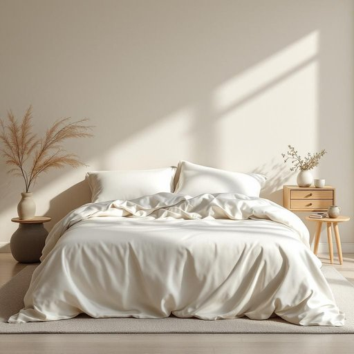

# silk

<h1 style="font-size: 2.5em; font-weight: 300; letter-spacing: 2px; margin: 0; color: #2c3e50;">
/sɪlk/
</h1>

---

---

## 例句

Although he was exhausted after the long journey, he insisted on finishing the intricate report, which not only required detailed analysis but also had to be submitted by the end of the day, so he worked tirelessly throughout the night without complaining.

*Although(/ˌɔlˈðoʊ/) he(/hi/) was(/wɑz/) exhausted(/ɪgˈzɔstɪd/) after(/ˈæftər/) the(/ðə/) long(/lɔŋ/) journey,(/ˈʤərni,/) he(/hi/) insisted(/ˌɪnˈsɪstɪd/) on(/ɔn/) finishing(/ˈfɪnɪʃɪŋ/) the(/ðə/) intricate(/ˈɪntrəkət/) report,(/rɪˈpɔrt,/) which(/wɪʧ/) not(/nɑt/) only(/ˈoʊnli/) required(/rikˈwaɪərd/) detailed(/dɪˈteɪld/) analysis(/æˈnælɪsɪs/) but(/bət/) also(/ˈɔlsoʊ/) had(/hæd/) to(/tɪ/) be(/bi/) submitted(/səbˈmɪtəd/) by(/baɪ/) the(/ðə/) end(/ɛnd/) of(/əv/) the(/ðə/) day,(/deɪ,/) so(/soʊ/) he(/hi/) worked(/wərkt/) tirelessly(/ˈtaɪrləsli/) throughout(/θruaʊt/) the(/ðə/) night(/naɪt/) without(/wɪˈθaʊt/) complaining.(/kəmˈpleɪnɪŋ./)*

**翻译：** 尽管长途跋涉使他筋疲力尽，但他仍坚持完成那份复杂的报告。该报告不仅需要详尽的分析，还必须在当天结束前提交，因此他整夜不辞辛劳地工作，毫无怨言。

---

## 解释

英语单词silk作为名词在家居生活用品场景中，通常指由蚕丝制成的织物或材料，广泛用于制作床上用品如丝绸床单、枕套、窗帘、沙发套等，因其质地光滑、柔软且具有良好的透气性而备受青睐。使用时，英语学习者需注意，silk作为不可数名词时常用于泛指这种材质，如silk sheets（丝绸床单），也可作为可数名词表示具体的丝绸制品，如a silk指一件丝绸制品，但后者较少见。常见搭配包括silk pillowcase（丝绸枕套）、pure silk（纯丝绸）、silk fabric（丝绸布料）等。此外，silk在语法上通常不加复数形式，习惯上会用其他词表达复数概念。词源上，silk源自古英语silc，进而来自拉丁语和希腊语的sericum，指的是古代中国的蚕丝贸易，反映了丝绸作为贵重奢侈品的历史背景。在中文语境中，silk应译为丝绸或简称丝，强调其天然蚕丝材料的属性，在家居用品中则突出其高级、柔软且舒适的特性。该词通常无贬义，但因丝绸文化多联想到奢华、精致和传统工艺，带有一定的正面、高端和文化价值色彩。

---

<small style="color: #999; font-size: 0.9em;">2025-07-27 09:14:04</small>

