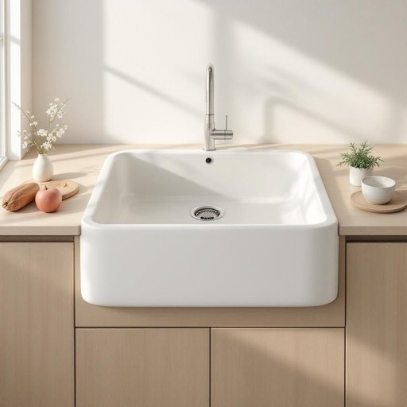

# sink

<h1 style="font-size: 2.5em; font-weight: 300; letter-spacing: 2px; margin: 0; color: #2c3e50;">
/sɪŋk/
</h1>

---

---

## 例句

Could you please make sure the dishes are rinsed properly before you leave them in the sink, which, as you know, tends to fill up quickly if we don’t wash up regularly and clear away any leftovers that might attract fruit flies or cause unpleasant smells?

*Could(/kʊd/) you(/ju/) please(/pliz/) make(/meɪk/) sure(/ʃʊr/) the(/ðə/) dishes(/ˈdɪʃɪz/) are(/ər/) rinsed(/rinsed*/) properly(/ˈprɑpərli/) before(/ˌbiˈfɔr/) you(/ju/) leave(/liv/) them(/ðɛm/) in(/ɪn/) the(/ðə/) sink,(/sɪŋk,/) which,(/wɪʧ,/) as(/ɛz/) you(/ju/) know,(/noʊ,/) tends(/tɛndz/) to(/tɪ/) fill(/fɪl/) up(/əp/) quickly(/kˈwɪkli/) if(/ɪf/) we(/wi/) don’t(/don’t*/) wash(/wɑʃ/) up(/əp/) regularly(/ˈrɛgjələrli/) and(/ənd/) clear(/klɪr/) away(/əˈweɪ/) any(/ˈɛni/) leftovers(/ˈlɛfˌtoʊvərz/) that(/ðət/) might(/maɪt/) attract(/əˈtrækt/) fruit(/frut/) flies(/flaɪz/) or(/ər/) cause(/kɔz/) unpleasant(/ənˈplɛzənt/) smells?(/smɛlz?/)*

**翻译：** 请您务必在将碗碟放入水槽前彻底冲洗干净。正如您所知，如果我们不定期清洗并清理残留物，水槽很容易迅速积满，而这些残渣还可能吸引果蝇或产生异味。

---

## 解释

英语单词'sink'作为名词在家居生活用品的语境中，通常指厨房或卫生间中的洗涤槽，即用来洗手、洗碗或清洗食物的固定装置，通常包含一个水池和排水系统。具体使用场合多见于描述厨房设备、家庭装修或日常生活中提及洗涤相关设施时，如“kitchen sink”（厨房水槽）、“bathroom sink”（洗手池）。英语学习者需要注意的是，作为名词的’sink’通常是可数名词，可以用复数形式’sinks’，且经常与表明位置或功能的词搭配，如“drain”表示排水孔，“plug”表示塞子。此外，常见表达有“wash in the sink”（在水槽里洗）、“sink full of water”（满是水的水槽）等。词源方面，’sink’来自中古英语“sinken”，意指下沉、沉没，反映了水流入排水系统时的动作，与其固定容器的功能关联。中文语境中，该词准确翻译为“水槽”或“洗涤槽”，强调其设计用于盛水和排水的家居设施。该词无褒贬色彩，属于中性词，文化内涵亦较简单，主要关联生活实用功能和家居环境。

---

<small style="color: #999; font-size: 0.9em;">2025-07-27 09:14:04</small>

