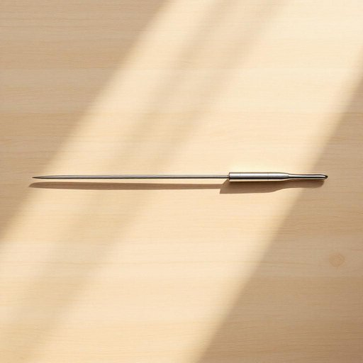

# skewer

<h1 style="font-size: 2.5em; font-weight: 300; letter-spacing: 2px; margin: 0; color: #2c3e50;">
/skjuər/
</h1>

---

---

## 例句

Could you please check the kitchen drawer for the stainless steel skewer that’s long enough to hold all the marinated vegetables and chunks of chicken, as I want to prepare them for the barbecue this weekend while ensuring they cook evenly over the coals?

*Could(/kʊd/) you(/ju/) please(/pliz/) check(/ʧɛk/) the(/ðə/) kitchen(/ˈkɪʧən/) drawer(/drɔr/) for(/fər/) the(/ðə/) stainless(/ˈsteɪnləs/) steel(/stil/) skewer(/skjuər/) that’s(/that’s*/) long(/lɔŋ/) enough(/ɪˈnəf/) to(/tɪ/) hold(/hoʊld/) all(/ɔl/) the(/ðə/) marinated(/ˈmɛrəˌneɪtɪd/) vegetables(/ˈvɛʤtəbəlz/) and(/ənd/) chunks(/ʧəŋks/) of(/əv/) chicken,(/ˈʧɪkən,/) as(/ɛz/) I(/aɪ/) want(/wɔnt/) to(/tɪ/) prepare(/priˈpɛr/) them(/ðɛm/) for(/fər/) the(/ðə/) barbecue(/ˈbɑrbɪˌkju/) this(/ðɪs/) weekend(/ˈwiˌkɪnd/) while(/waɪl/) ensuring(/ɪnˈʃʊrɪŋ/) they(/ðeɪ/) cook(/kʊk/) evenly(/ˈivənli/) over(/ˈoʊvər/) the(/ðə/) coals?(/koʊlz?/)*

**翻译：** 请帮忙查看一下厨房抽屉里有没有足够长的不锈钢串叉，可以串起所有腌制好的蔬菜和鸡肉块，我想借此为这个周末的烧烤做好准备，确保它们能在炭火上均匀烤熟。

---

## 解释

英语单词"skewer"作为名词，在家居生活用品的语境中指的是一种细长的金属或木制棒，用于将食物如肉、蔬菜串起来以便烤制或烧烤，常见于烧烤、串烧等场合。学习者在使用时需注意其单复数形式，单数为"skewer"，复数为"skewers"，此外常见搭配有"metal skewer"（金属串签）、"wooden skewer"（木串签）、"grilling skewer"（烧烤串签）等，表达时应明确指出材质或用途以避免歧义。词源上，"skewer"源自中古英语“skewere”，其根源可能是古挪威语或古英语单词，原意即指用以刺穿食物的尖棒，体现了其功能性和实用性。在中文语境中，"skewer"通常被翻译为“串签”或“烤串签”，反映其用于穿串食材的工具属性，需注意避免与“肉签”、“羊肉串”等具体食物混用，因为"skewer"强调工具本身而非其中的食品。该词本身无特殊褒贬色彩，属于中性词汇，主要体现在饮食文化和烹饪习惯中，常见于家庭烧烤、野餐等休闲场合，是描述烧烤用具的重要词汇。

---

<small style="color: #999; font-size: 0.9em;">2025-07-27 09:14:04</small>

