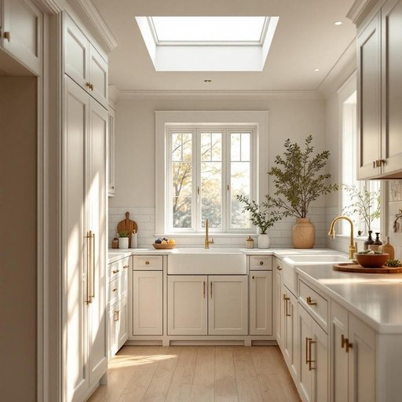

# skylight

<h1 style="font-size: 2.5em; font-weight: 300; letter-spacing: 2px; margin: 0; color: #2c3e50;">
/ˈskaɪˌlaɪt/
</h1>

---

---

## 例句

Although the Victorian house exuded charm, the decision to install a skylight in the kitchen ceiling aimed to enhance the space with natural light during the day and cultivate a cozy atmosphere by nightfall.

*Although(/ˌɔlˈðoʊ/) the(/ðə/) Victorian(/vɪkˈtɔriən/) house(/haʊs/) exuded(/ɪgˈzudɪd/) charm,(/ʧɑrm,/) the(/ðə/) decision(/dɪˈsɪʒən/) to(/tɪ/) install(/ˌɪnˈstɔl/) a(/ə/) skylight(/ˈskaɪˌlaɪt/) in(/ɪn/) the(/ðə/) kitchen(/ˈkɪʧən/) ceiling(/ˈsilɪŋ/) aimed(/eɪmd/) to(/tɪ/) enhance(/ɛnˈhæns/) the(/ðə/) space(/speɪs/) with(/wɪθ/) natural(/ˈnæʧərəl/) light(/laɪt/) during(/ˈdʊrɪŋ/) the(/ðə/) day(/deɪ/) and(/ənd/) cultivate(/ˈkəltəˌveɪt/) a(/ə/) cozy(/ˈkoʊzi/) atmosphere(/ˈætməsˌfɪr/) by(/baɪ/) nightfall.(/ˈnaɪtˌfɔl./)*

**翻译：** 尽管这座维多利亚风格的房子散发着独特的魅力，但在厨房天花板安装天窗的决定，旨在白天引入自然光线，提升空间感，同时在夜晚营造出温馨宜人的氛围。

---

## 解释

“skylight”作为名词，指的是建筑物顶部或屋顶上安装的窗户或透明部分，用以引入自然光，常见于住宅、办公室或其他室内空间，以增加采光和通风。在家居生活用品的语境中，当人们谈论“skylight”时，通常是在描述房屋设计、装修或室内光线改善方面的内容，比如“安装一个skylight可以让房间更明亮”。英语学习者使用该词时需注意，skylight是可数名词，复数形式为“skylights”，常见搭配有“install a skylight”（安装天窗）、“natural light through the skylight”（通过天窗进入的自然光）等。此外，skylight常与“roof”（屋顶）、“window”（窗户）、“light”（光）等词搭配使用，表达建筑采光的功能。词源上，skylight由“sky”（天空）和“light”（光）构成，字面上意为“天空的光”，源于建筑设计中引入天空光线的初衷。中文中“skylight”准确翻译为“天窗”，这一词汇直接表达了其物理形态和功能属性，无特殊褒贬色彩，属于中性词。其文化内涵体现出对自然光的利用和现代住宅设计中注重采光与节能的人文理念，因而在家居装修领域常被视作提升居住品质的积极元素。

---

<small style="color: #999; font-size: 0.9em;">2025-07-27 09:14:04</small>

