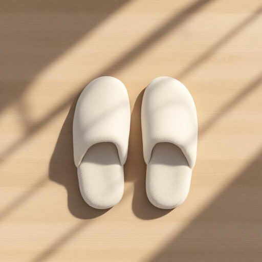

# slipper

<h1 style="font-size: 2.5em; font-weight: 300; letter-spacing: 2px; margin: 0; color: #2c3e50;">
/sˈlɪpər/
</h1>

---

---

## 例句

After hours of negotiation, the lawyer presented the contract, a crucial legal document that not only outlined the responsibilities of both parties but also included several clauses to protect intellectual property rights and mitigate potential disputes in the future.

*After(/ˈæftər/) hours(/aʊərz/) of(/əv/) negotiation,(/nɪˌgoʊʃiˈeɪʃən,/) the(/ðə/) lawyer(/ˈlɔjər/) presented(/pərˈzɛnəd/) the(/ðə/) contract,(/ˈkɑnˌtrækt,/) a(/ə/) crucial(/ˈkruʃəl/) legal(/ˈligəl/) document(/ˈdɑkjəmɛnt/) that(/ðət/) not(/nɑt/) only(/ˈoʊnli/) outlined(/ˈaʊˌtlaɪnd/) the(/ðə/) responsibilities(/riˌspɑnsəˈbɪlətiz/) of(/əv/) both(/boʊθ/) parties(/ˈpɑrtiz/) but(/bət/) also(/ˈɔlsoʊ/) included(/ˌɪnˈkludɪd/) several(/ˈsɛvərəl/) clauses(/ˈklɔzɪz/) to(/tɪ/) protect(/prəˈtɛkt/) intellectual(/ˌɪnəˈlɛkʧuəl/) property(/ˈprɑpərti/) rights(/raɪts/) and(/ənd/) mitigate(/ˈmɪtəˌgeɪt/) potential(/pəˈtɛnʃəl/) disputes(/dɪˈspjuts/) in(/ɪn/) the(/ðə/) future.(/fˈjuʧər./)*

**翻译：** 经过数小时的谈判，律师提交了合同，这份重要的法律文件不仅明确了双方的职责，还包含了若干条款，以保护知识产权并防范未来可能出现的争议。

---

## 解释

英语单词“slipper”作为名词，在家居生活用品的语境中指的是一种轻便、柔软、舒适的室内拖鞋，通常用于居家时穿着以保护脚部、保暖或防滑。具体使用场合多见于描述日常家居生活，比如“wearing slippers at home”（在家穿拖鞋）、“put on your slippers before stepping on the cold floor”（在踩冷地板前穿上拖鞋）。英语学习者在使用该词时应注意其单复数形式为slipper/slippers，且常见搭配有“pair of slippers”（一双拖鞋）、“house slippers”（室内拖鞋）、“slipper socks”（带防滑底的拖鞋袜）等，表达时通常需结合修饰词准确描述拖鞋的类型或用途。同时，slipper一般作可数名词，强调具体一双或多双拖鞋。该词源自中古英语“slip”意为滑动，体现拖鞋穿脱方便、脚步轻盈的特性，形成“slipper”表轻便鞋的含义。中文语境下，slipper准确翻译为“拖鞋”，尤其指室内使用的软底鞋，与室外穿的鞋（鞋子、皮鞋）区分开来，无贬义，通常带有温馨、舒适的生活氛围色彩。文化上，拖鞋在英美等西方国家尤为普遍，是居家生活的重要用品之一，体现休闲和安全的生活习惯。总之，slipper为纯中性词，主要描绘居家穿着的舒适鞋类，英语学习者应准确把握其含义及常见搭配，以便在日常交流中自然使用。

---

<small style="color: #999; font-size: 0.9em;">2025-07-27 09:14:04</small>

