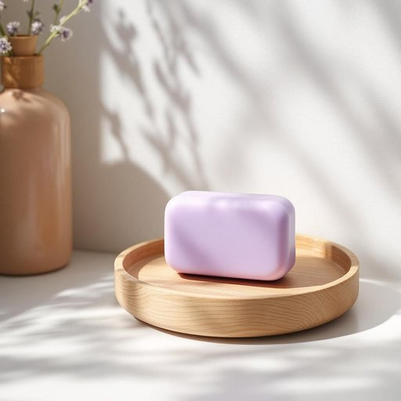

# soap

<h1 style="font-size: 2.5em; font-weight: 300; letter-spacing: 2px; margin: 0; color: #2c3e50;">
/soʊp/
</h1>

---

---

## 例句

Could you please grab the lavender-scented soap from the bathroom cabinet, the one we bought last month that’s meant to be gentle on sensitive skin and perfect for both handwashing and showering, because I ran out of my usual brand this morning?

*Could(/kʊd/) you(/ju/) please(/pliz/) grab(/græb/) the(/ðə/) lavender-scented(/lavender-scented*/) soap(/soʊp/) from(/frəm/) the(/ðə/) bathroom(/ˈbæθˌrum/) cabinet,(/ˈkæbənət,/) the(/ðə/) one(/wən/) we(/wi/) bought(/bɔt/) last(/læst/) month(/mənθ/) that’s(/that’s*/) meant(/mɛnt/) to(/tɪ/) be(/bi/) gentle(/ˈʤɛnəl/) on(/ɔn/) sensitive(/ˈsɛnsɪtɪv/) skin(/skɪn/) and(/ənd/) perfect(/ˈpərˌfɪkt/) for(/fər/) both(/boʊθ/) handwashing(/handwashing*/) and(/ənd/) showering,(/ʃaʊərɪŋ,/) because(/bɪˈkəz/) I(/aɪ/) ran(/ræn/) out(/aʊt/) of(/əv/) my(/maɪ/) usual(/ˈjuʒəwəl/) brand(/brænd/) this(/ðɪs/) morning?(/ˈmɔrnɪŋ?/)*

**翻译：** 你能帮我从浴室的柜子里拿一下上个月买的那块薰衣草香氛皂吗？那块皂适合敏感肌肤，既能洗手也适合沐浴，我今天早上用完了平时的牌子。

---

## 解释

英语单词“soap”作为名词在家居生活用品语境中，主要指肥皂，是一种用于清洁皮肤或物品的固体或液体清洁剂，常出现在洗手间、厨房等场合，如洗手、洗澡或清洁衣物时使用。学习者需要注意该词为可数名词，常见的用法有“一块肥皂”（a bar of soap）或“一瓶液体肥皂”（a bottle of liquid soap），与单位词搭配时需使用复数形式“soaps”，但日常中多用不可数表示肥皂总体概念。常见搭配有“洗手皂”（hand soap）、“肥皂分配器”（soap dispenser）等，表达时也常用“soap up”作动词短语表示“擦肥皂使起泡”。“Soap”一词源自古英语“sāpe”，源自拉丁语“sapo”，这一词根体现了肥皂用作清洁剂的长久历史及文化传承。在中文语境中，准确翻译为“肥皂”，强调其作为清洁用品的功能，无褒贬色彩，但在西方文化中“soap”除了字面意义外，还引申为所谓“肥皂剧”（soap opera），具有特定文化内涵，但在家居用品语境下该词不会带有特殊色彩或隐喻，学习时需结合具体语境理解。

---

<small style="color: #999; font-size: 0.9em;">2025-07-27 09:14:04</small>

