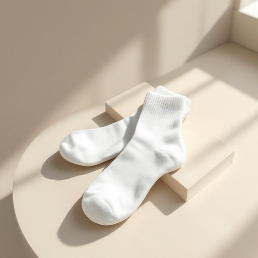

# sock

<h1 style="font-size: 2.5em; font-weight: 300; letter-spacing: 2px; margin: 0; color: #2c3e50;">
/sɑk/
</h1>

---

---

## 例句

The basket on the shelf contained an assortment of ancient artifacts that archaeologists believed could reveal significant insights into the civilization's culture and daily life.

*The(/ðə/) basket(/ˈbæskət/) on(/ɔn/) the(/ðə/) shelf(/ʃɛlf/) contained(/kənˈteɪnd/) an(/ən/) assortment(/əˈsɔrtmənt/) of(/əv/) ancient(/ˈeɪnʧənt/) artifacts(/ˈɑrtəˌfækts/) that(/ðət/) archaeologists(/ˌɑrkiˈɑləʤɪsts/) believed(/bɪˈlivd/) could(/kʊd/) reveal(/rɪˈvil/) significant(/sɪgˈnɪfɪkənt/) insights(/ˈɪnˌsaɪts/) into(/ˈɪntu/) the(/ðə/) civilization's(/civilization's*/) culture(/ˈkəlʧər/) and(/ənd/) daily(/ˈdeɪli/) life.(/laɪf./)*

**翻译：** 架子上的篮子里装着各式各样的古代文物，考古学家认为这些文物能够揭示该文明的文化和日常生活的重要见解。

---

## 解释

英语单词“sock”作为名词在家居生活用品场景中，指的是穿在脚上的一种贴身织物制品，用于保暖、吸汗和保护脚部，通常与鞋子搭配使用。具体使用场合多见于日常穿着、洗衣整理或购买衣物时的描述，例如说“I need a clean pair of socks”（我需要一双干净的袜子）或“Where are my socks?”（我的袜子在哪？）。英语学习者在使用时应注意，“sock”通常为可数名词，复数形式为“socks”，且在表示一双时常用“a pair of socks”表达，不能直接说“a sock”表示一双。此外，常见搭配有“cotton socks”（棉袜）、“wool socks”（羊毛袜）、“cotton ankle socks”（棉质短袜）等，表达技巧上，使用具体材质或长度的形容词能使表达更准确。词源方面，“sock”源自古英语“socca”，意指轻便、紧贴脚的鞋子或袜子，最初来源于拉丁语“soccus”，一种低帮鞋，这一背景体现了其作为脚部贴身穿着物的历史演变。中文中“sock”准确翻译为“袜子”，涵盖了各种类型和材质的袜子。在中文语境下，“袜子”通常中性无褒贬色彩，但在英语中，“sock”偶尔也用于俚语中，如“to sock someone”意为“狠打某人”，语义完全不同，需注意区分。总体而言，“sock”在家居生活用品语境中为常用且基础词汇，理解其具体用法和文化背景有助于准确表达和理解日常生活相关话题。

---

<small style="color: #999; font-size: 0.9em;">2025-07-27 09:14:04</small>

