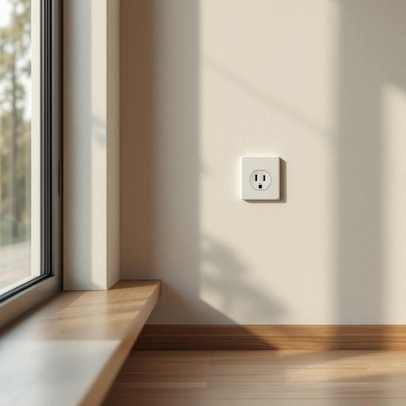

# socket

<h1 style="font-size: 2.5em; font-weight: 300; letter-spacing: 2px; margin: 0; color: #2c3e50;">
/ˈsɑkət/
</h1>

---

---

## 例句

Before you plug in the new lamp, make sure the socket by the window, which sometimes sparks when overloaded, is properly fitted and hasn’t been damaged by the recent damp weather.

*Before(/ˌbiˈfɔr/) you(/ju/) plug(/pləg/) in(/ɪn/) the(/ðə/) new(/nu/) lamp,(/læmp,/) make(/meɪk/) sure(/ʃʊr/) the(/ðə/) socket(/ˈsɑkət/) by(/baɪ/) the(/ðə/) window,(/ˈwɪndoʊ,/) which(/wɪʧ/) sometimes(/ˈsəmˌtaɪmz/) sparks(/spɑrks/) when(/wɪn/) overloaded,(/ˈoʊvərˌloʊdɪd,/) is(/ɪz/) properly(/ˈprɑpərli/) fitted(/ˈfɪtɪd/) and(/ənd/) hasn’t(/hasn’t*/) been(/bɪn/) damaged(/ˈdæmɪʤd/) by(/baɪ/) the(/ðə/) recent(/ˈrisənt/) damp(/dæmp/) weather.(/ˈwɛðər./)*

**翻译：** 在接入新灯之前，请确保靠窗的插座安装稳妥，该插座在过载时偶尔会产生火花，且未因近期潮湿天气而受损。

---

## 解释

英语单词“socket”在家居生活用品的语境中作名词使用时，主要指“插座”或“插孔”，即墙壁上用于插入电器插头以获取电源的部件，常见于家庭、办公室等室内环境中。具体使用场合包括描述电器的连接、电源供应或设备安装，如“插头插入插座”（plug into the socket）或“更换墙壁插座”（replace the wall socket）。学习者使用该词时需注意其复数形式为“sockets”，并且常与动词“plug”（插入）、“insert”（插入）、“fit”（适配）等搭配，表达技巧方面，socket前可用定冠词“the”指代特定插座，或用形容词修饰以明确类型，比如“power socket”（电源插座）、“light socket”（灯座），此外，socket还用于描述灯泡的孔位或某些设备内部的接口。词源上，“socket”源自中古英语，原意为“凹槽”或“套口”，源自古法语“soquet”，意指装配或镶嵌部位，体现其“容纳插入物”的功能，语言色彩中性，无褒贬含义，文化内涵较为直接，注重实用功能。在中文语境中，“socket”准确翻译为“插座”时需区分具体类型，如电源插座、网线插座或灯座等，避免混淆。整体而言，“socket”作为家居用品名词表达的是一个物理接口或连接点，是生活中非常常用且实用性强的词汇，适合各类场合描述电器和设备的连接形式。

---

<small style="color: #999; font-size: 0.9em;">2025-07-27 09:14:04</small>

