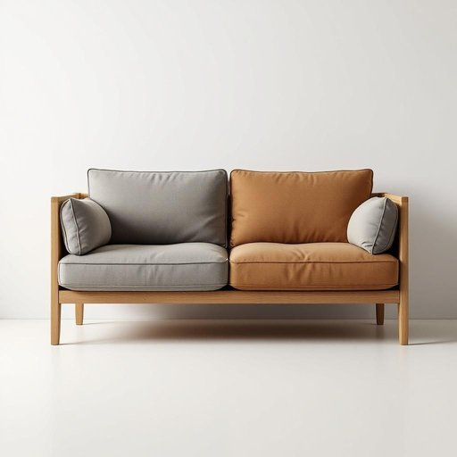

# sofa

<h1 style="font-size: 2.5em; font-weight: 300; letter-spacing: 2px; margin: 0; color: #2c3e50;">
/ˈsoʊfə/
</h1>

---

---

## 例句

After a long day of work, I love sinking into the worn leather sofa in the living room, which, despite its slightly creaky springs and faded cushions, remains the coziest spot for reading a book or having a relaxed chat with friends over a cup of tea.

*After(/ˈæftər/) a(/ə/) long(/lɔŋ/) day(/deɪ/) of(/əv/) work,(/wərk,/) I(/aɪ/) love(/ləv/) sinking(/ˈsɪŋkɪŋ/) into(/ˈɪntu/) the(/ðə/) worn(/wɔrn/) leather(/ˈlɛðər/) sofa(/ˈsoʊfə/) in(/ɪn/) the(/ðə/) living(/ˈlɪvɪŋ/) room,(/rum,/) which,(/wɪʧ,/) despite(/dɪˈspaɪt/) its(/ɪts/) slightly(/sˈlaɪtli/) creaky(/ˈkriki/) springs(/spərɪŋz/) and(/ənd/) faded(/ˈfeɪdɪd/) cushions,(/ˈkʊʃənz,/) remains(/rɪˈmeɪnz/) the(/ðə/) coziest(/coziest*/) spot(/spɑt/) for(/fər/) reading(/ˈrɛdɪŋ/) a(/ə/) book(/bʊk/) or(/ər/) having(/ˈhævɪŋ/) a(/ə/) relaxed(/rɪˈlækst/) chat(/ʧæt/) with(/wɪθ/) friends(/frɛndz/) over(/ˈoʊvər/) a(/ə/) cup(/kəp/) of(/əv/) tea.(/ti./)*

**翻译：** 忙碌一天后，我最喜欢沉浸在客厅里那张有些破旧的皮沙发上。尽管沙发的弹簧微微作响，靠垫也已褪色，但它依然是阅读书籍或与朋友悠闲地品茶聊天时最温馨舒适的角落。

---

## 解释

英语单词“sofa”作为名词，在家居生活用品的语境中指一种带有软垫和扶手的长椅，通常用于起居室或客厅，供多人坐卧休息或接待客人。具体使用场合多为描述家具布局、家居装饰或购物时，如“a comfortable sofa in the living room”（客厅里一张舒适的沙发）。英语学习者在使用“sofa”时需注意其作为可数名词，复数形式为“sofas”，常见搭配有“a leather sofa”表示真皮沙发、“a sofa set”指沙发组合、“to sit on the sofa”表示坐在沙发上等。此外，“sofa”通常与“couch”相似，但“couch”在美式英语中有时语义更宽泛，且稍带口语色彩。词源上，“sofa”来源于阿拉伯语“ṣuffah”，意指一种带软垫的长凳，经奥斯曼土耳其语传入欧洲，后进入英语，体现了东西方家具文化的交流。在中文语境中，“sofa”准确翻译为“沙发”，该词在现代汉语中普遍接受，无褒贬色彩，且因其外来词身份，通常指代现代家居中软垫长椅，强调舒适与休闲功能。总之，“sofa”是描述特定类型家居坐具的标准词汇，适用于正式和日常语境中，语言色彩中性且文化内涵较为通用。

---

<small style="color: #999; font-size: 0.9em;">2025-07-27 09:14:04</small>

