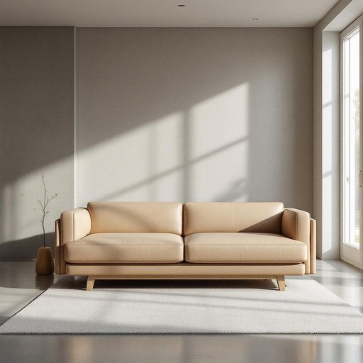

# sofabed

<h1 style="font-size: 2.5em; font-weight: 300; letter-spacing: 2px; margin: 0; color: #2c3e50;">
/sofabed*/
</h1>

---

---

## 例句

After rearranging the living room to accommodate unexpected guests, we discovered that the sofabed, which cleverly transforms from a sleek leather couch into a surprisingly comfortable double bed, was not only space-saving but also an essential piece of furniture for hosting overnight visitors without sacrificing style or practicality.

*After(/ˈæftər/) rearranging(/ˌriərˈeɪnʤɪŋ/) the(/ðə/) living(/ˈlɪvɪŋ/) room(/rum/) to(/tɪ/) accommodate(/əˈkɑməˌdeɪt/) unexpected(/ˌənɪkˈspɛktɪd/) guests,(/gɛsts,/) we(/wi/) discovered(/dɪˈskəvərd/) that(/ðət/) the(/ðə/) sofabed,(/sofabed*,/) which(/wɪʧ/) cleverly(/ˈklɛvərli/) transforms(/trænsˈfɔrmz/) from(/frəm/) a(/ə/) sleek(/slik/) leather(/ˈlɛðər/) couch(/kaʊʧ/) into(/ˈɪntu/) a(/ə/) surprisingly(/səˈpraɪzɪŋli/) comfortable(/ˈkəmfərtəbəl/) double(/ˈdəbəl/) bed,(/bɛd,/) was(/wɑz/) not(/nɑt/) only(/ˈoʊnli/) space-saving(/space-saving*/) but(/bət/) also(/ˈɔlsoʊ/) an(/ən/) essential(/ɛˈsɛnʃəl/) piece(/pis/) of(/əv/) furniture(/ˈfərnɪʧər/) for(/fər/) hosting(/ˈhoʊstɪŋ/) overnight(/ˈoʊvərˈnaɪt/) visitors(/ˈvɪzɪtərz/) without(/wɪˈθaʊt/) sacrificing(/ˈsækrəˌfaɪsɪŋ/) style(/staɪl/) or(/ər/) practicality.(/ˌpræktɪˈkæləti./)*

**翻译：** 在重新布置客厅以接待意外来访的客人时，我们发现这款沙发床不仅巧妙地从简洁的皮质沙发转换成一张意外舒适的双人床，节省了空间，更是招待过夜访客时既不失格调又兼具实用性的必备家具。

---

## 解释

英语单词“sofabed”作为名词，在家居生活用品的语境中指的是一种兼具沙发和床功能的家具，通常用于客厅或多功能房间，适合临时招待客人过夜或节省空间的环境。使用时，英语学习者应注意“sofabed”多作为可数名词，复数形式为“sofabeds”，且在表达时常与形容词连用，如“comfortable sofabed”或“convertible sofabed”，也可与动词短语搭配，如“to pull out a sofabed”（拉出沙发床）或“to fold a sofabed back”。语法上，“sofabed”通常不单独作为动词使用，而是名词中心，描述具体家具。该词由“sofa”和“bed”复合而成，起源于二十世纪英美家具工业的发展，旨在满足有限空间内家具多功能性的需求，反映了现代家居生活对实用性和灵活性的追求。在中文语境中，“sofabed”准确翻译为“沙发床”，即一种既可当沙发又可当床使用的家具，强调其实用性和空间利用价值，无特殊褒贬色彩，属于中性词汇，广泛见于家具销售和家居装修领域。总体而言，理解“sofabed”应结合其多功能家具属性，把握其在现代生活中简约实用的文化背景。

---

<small style="color: #999; font-size: 0.9em;">2025-07-27 09:14:04</small>

