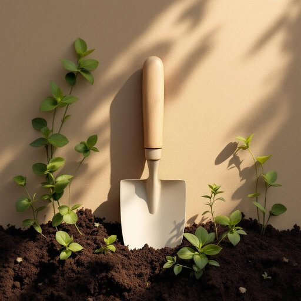

# spade

<h1 style="font-size: 2.5em; font-weight: 300; letter-spacing: 2px; margin: 0; color: #2c3e50;">
/speɪd/
</h1>

---

---

## 例句

Before the meeting, the spade was accidentally left outside, which caused a delay in preparing the soil for planting.

*Before(/ˌbiˈfɔr/) the(/ðə/) meeting,(/ˈmitɪŋ,/) the(/ðə/) spade(/speɪd/) was(/wɑz/) accidentally(/ˌæksəˈdɛnəli/) left(/lɛft/) outside,(/ˈaʊtˈsaɪd,/) which(/wɪʧ/) caused(/kɔzd/) a(/ə/) delay(/dɪˈleɪ/) in(/ɪn/) preparing(/pərˈpɛrɪŋ/) the(/ðə/) soil(/sɔɪl/) for(/fər/) planting.(/ˈplæntɪŋ./)*

**翻译：** 会议前，铁锹不小心被遗落在外，导致准备土壤种植的工作延误。

---

## 解释

英语单词“spade”作为名词在家居生活用品的语境中，主要指一种园艺工具，即铁铲或小锹，用于挖土、松土或移植植物，常见于家庭花园、阳台绿植或庭院处理中，具体使用场合包括家庭园艺活动、园林维护或户外土方作业时，例如“Use a spade to dig a hole for the plant”（用铲子挖个洞种植物），英语学习者在使用“spade”时需注意它作为可数名词时通常用复数“spades”表示多个铲子，且在搭配上常见表达有“garden spade”（园艺铲）、“spade handle”（铲柄）等，此外“spade”不能与“shovel”（铁锹，较宽口）混用，两者用途和形状有所区别，其词源来自中古英语，可能源自古英语“spadu”或“spæd”，进一步来自北欧语，反映其作为工具的历史悠久和实用性，在中文语境中，“spade”对应“铁铲”或“小锹”，强调其园艺挖掘功能，翻译时应结合用途确定具体词汇，避免误用成通用铁锹或铲子，此词语本身无褒贬色彩，属于中性实用工具词汇，但需注意在其他语境，如扑克花色中“spade”指黑桃，与家居用具性质完全不同，应根据语境区分理解。

---

<small style="color: #999; font-size: 0.9em;">2025-07-27 09:14:04</small>

