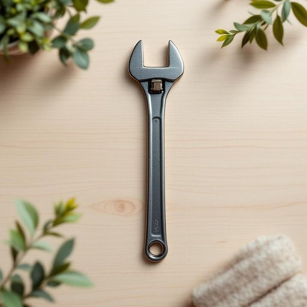

# spanner

<h1 style="font-size: 2.5em; font-weight: 300; letter-spacing: 2px; margin: 0; color: #2c3e50;">
/ˈspænər/
</h1>

---

---

## 例句

Could you please pass me the spanner that’s usually kept in the red toolbox under the kitchen sink, because I need to tighten the loose bolts on the dining table legs before our guests arrive this evening?

*Could(/kʊd/) you(/ju/) please(/pliz/) pass(/pæs/) me(/mi/) the(/ðə/) spanner(/ˈspænər/) that’s(/that’s*/) usually(/ˈjuʒəwəli/) kept(/kɛpt/) in(/ɪn/) the(/ðə/) red(/rɛd/) toolbox(/ˈtulˌbɔks/) under(/ˈəndər/) the(/ðə/) kitchen(/ˈkɪʧən/) sink,(/sɪŋk,/) because(/bɪˈkəz/) I(/aɪ/) need(/nid/) to(/tɪ/) tighten(/ˈtaɪtən/) the(/ðə/) loose(/lus/) bolts(/boʊlts/) on(/ɔn/) the(/ðə/) dining(/ˈdaɪnɪŋ/) table(/ˈteɪbəl/) legs(/lɛgz/) before(/ˌbiˈfɔr/) our(/ɑr/) guests(/gɛsts/) arrive(/əraɪv/) this(/ðɪs/) evening?(/ˈivnɪŋ?/)*

**翻译：** 请你帮我拿一下平时放在厨房水槽下红色工具箱里的扳手吗？我需要在今晚客人到来之前，把餐桌腿上松动的螺栓拧紧。

---

## 解释

英语单词“spanner”在家居生活用品的语境中作为名词，主要指一种用于拧紧或松开螺母和螺栓的工具，即扳手。具体使用场合通常是家庭维修、家具组装、管道修理等需要调整紧固件的场景。在英语学习中，使用“spanner”时应注意它是一个可数名词，常见搭配包括“adjustable spanner”（活动扳手）、“ring spanner”（环形扳手）、“open-ended spanner”（开口扳手）等，表达时注意前面的形容词用法和名词单复数形式。此外，“spanner”在英式英语中使用更为普遍，而在美式英语中对应的词汇是“wrench”，二者在用词习惯上有所区别。词源方面，“spanner”源自19世纪德国的“Spanner”，意为“夹紧装置”，进入英语后特指用来夹紧螺母的工具。中文语境中，准确翻译为“扳手”，强调其作为手工具的功能，不同于“螺丝刀”等其他维修工具。在文化色彩方面，“spanner”无明显褒贬意味，属于中性词汇，但在英美口语中，“throw a spanner in the works”是一个习语，意为“制造麻烦或障碍”，这点需注意避免字面直译。整体而言，“spanner”作为家用维修常见工具词汇，理解其具体指代及与美式英语“wrench”的区别，有助于英语学习者准确使用和理解。

---

<small style="color: #999; font-size: 0.9em;">2025-07-27 09:14:04</small>

