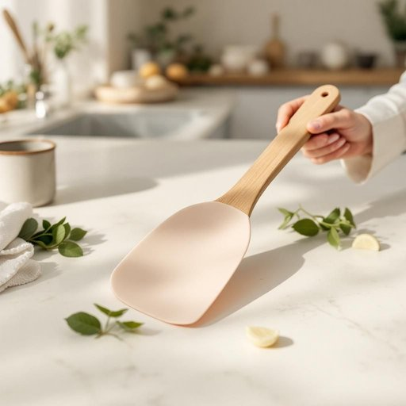

# spatula

<h1 style="font-size: 2.5em; font-weight: 300; letter-spacing: 2px; margin: 0; color: #2c3e50;">
/ˈspæˌʧʊlə/
</h1>

---

---

## 例句

Could you please hand me the spatula that has the wooden handle and the slightly curved silicone blade, which I usually use for flipping pancakes on the non-stick griddle, as I need to carefully lift them without breaking their delicate edges?

*Could(/kʊd/) you(/ju/) please(/pliz/) hand(/hænd/) me(/mi/) the(/ðə/) spatula(/ˈspæˌʧʊlə/) that(/ðət/) has(/həz/) the(/ðə/) wooden(/ˈwʊdən/) handle(/ˈhændəl/) and(/ənd/) the(/ðə/) slightly(/sˈlaɪtli/) curved(/kərvd/) silicone(/ˈsɪləˌkoʊn/) blade,(/bleɪd,/) which(/wɪʧ/) I(/aɪ/) usually(/ˈjuʒəwəli/) use(/juz/) for(/fər/) flipping(/ˈflɪpɪŋ/) pancakes(/ˈpænˌkeɪks/) on(/ɔn/) the(/ðə/) non-stick(/nɑnˈstɪk/) griddle,(/griddle*,/) as(/ɛz/) I(/aɪ/) need(/nid/) to(/tɪ/) carefully(/ˈkɛrfəli/) lift(/lɪft/) them(/ðɛm/) without(/wɪˈθaʊt/) breaking(/ˈbreɪkɪŋ/) their(/ðɛr/) delicate(/ˈdɛləkət/) edges?(/ˈɛʤɪz?/)*

**翻译：** 请把那个带木柄、带有微微弯曲硅胶刃的铲子递给我，好让我小心地翻动平底不粘锅里做的煎饼，避免弄破它们娇嫩的边缘。

---

## 解释

英语单词“spatula”在家居生活用品的语境中作为名词，通常指一种厨房用具，用于翻炒、翻动食物或刮取容器内的食材，具体使用场合多见于烹饪过程，如煎蛋时用来翻面、搅拌或从平底锅中取出食物，也常用于刮取碗底或容器壁上的糊状物。学习者需要注意，spatula既可指较宽扁平的塑料或橡胶刮铲（如烘焙用的橡胶抹刀），也可指金属制的、边缘较薄用于翻炒的铲子，具体含义依语境区分；语法上spatula为可数名词，常与形容词搭配如“silicone spatula”（硅胶抹刀）、“metal spatula”（金属铲），动词常见搭配有“use a spatula to flip”（用铲子翻动）等。词源上，“spatula”源自拉丁语“spatula”，意为“小铲子、刮刀”，是“spatha”（剑）的缩小形式，形象地体现了该工具扁平且稍呈刀状的特征。在中文语境中，“spatula”较准确的翻译为“刮刀”、“铲子”或“锅铲”，根据具体品类和用途区别，避免泛泛称为“铲子”以免混淆其他厨具。该词无明显特殊语言色彩或褒贬含义，属中性词汇，通常出现在厨房用具描述及烹饪操作语境中，掌握其具体用途和材质差异有助于准确理解和使用。

---

<small style="color: #999; font-size: 0.9em;">2025-07-27 09:14:04</small>

