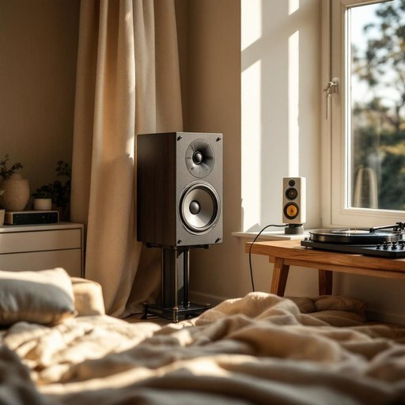

# speaker

<h1 style="font-size: 2.5em; font-weight: 300; letter-spacing: 2px; margin: 0; color: #2c3e50;">
/ˈspikər/
</h1>

---

---

## 例句

Could you please check if the speaker in the living room, which I carefully positioned near the bay window to take advantage of the natural acoustics, is properly connected to the amplifier, since it’s been producing a faint crackling noise every time we play vinyl records on the vintage turntable?

*Could(/kʊd/) you(/ju/) please(/pliz/) check(/ʧɛk/) if(/ɪf/) the(/ðə/) speaker(/ˈspikər/) in(/ɪn/) the(/ðə/) living(/ˈlɪvɪŋ/) room,(/rum,/) which(/wɪʧ/) I(/aɪ/) carefully(/ˈkɛrfəli/) positioned(/pəˈzɪʃənd/) near(/nɪr/) the(/ðə/) bay(/beɪ/) window(/ˈwɪndoʊ/) to(/tɪ/) take(/teɪk/) advantage(/ædˈvæntɪʤ/) of(/əv/) the(/ðə/) natural(/ˈnæʧərəl/) acoustics,(/əˈkustɪks,/) is(/ɪz/) properly(/ˈprɑpərli/) connected(/kəˈnɛktɪd/) to(/tɪ/) the(/ðə/) amplifier,(/ˈæmpləˌfaɪər,/) since(/sɪns/) it’s(/it’s*/) been(/bɪn/) producing(/prəˈdusɪŋ/) a(/ə/) faint(/feɪnt/) crackling(/ˈkræklɪŋ/) noise(/nɔɪz/) every(/ˈɛvəri/) time(/taɪm/) we(/wi/) play(/pleɪ/) vinyl(/ˈvaɪnəl/) records(/ˈrɛkərdz/) on(/ɔn/) the(/ðə/) vintage(/ˈvɪntɪʤ/) turntable?(/ˈtərnˌteɪbəl?/)*

**翻译：** 请您帮忙检查一下客厅的音箱是否正确连接到功放上？我特意将它放置在飘窗附近，以充分利用自然声学效果，但每当我们用那台复古黑胶唱机播放唱片时，都会听到轻微的噼啪声。

---

## 解释

英语单词“speaker”在家居生活用品的语境中作为名词，通常指的是用于播放声音的扬声器设备，具体使用场合包括家庭娱乐系统、电视音响、电脑音箱、蓝牙音响等，这类设备能够将电信号转换为声音，提升听觉体验。学习者使用该词时需注意其单复数形式为speakers，常见搭配有“a speaker system”（音响系统）、“wireless speaker”（无线扬声器）、“Bluetooth speaker”（蓝牙扬声器）等，表达时强调其作为物品的功能属性；在语法上应注意该词作为可数名词使用，应根据具体数量确定冠词或数量词。该词源自古英语“speak”加上表示执行者的后缀“-er”，本义为“说话者”，但在现代家居用品中转义为“发声装置”，体现了从“说话”到“发声”的语义演变。在中文语境中，“speaker”准确译为“扬声器”或“音响”，强调其电子设备属性，需区别于“讲演者”或“发言人”等抽象意义。此词在家居用品领域无褒贬色彩，属于中性技术名词，文化内涵主要与现代家庭娱乐和智能设备的普及密切相关。

---

<small style="color: #999; font-size: 0.9em;">2025-07-27 09:14:04</small>

