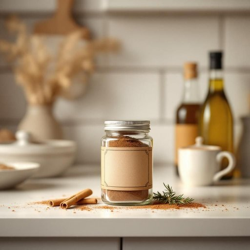

# spice

<h1 style="font-size: 2.5em; font-weight: 300; letter-spacing: 2px; margin: 0; color: #2c3e50;">
/spaɪs/
</h1>

---

---

## 例句

Could you please check the spice container in the kitchen cabinet, as its label has faded significantly, and it's placed adjacent to the olive oils and vinegars row, which I need in order to enhance the apple pie mixture with cinnamon before baking?

*Could(/kʊd/) you(/ju/) please(/pliz/) check(/ʧɛk/) the(/ðə/) spice(/spaɪs/) container(/kənˈteɪnər/) in(/ɪn/) the(/ðə/) kitchen(/ˈkɪʧən/) cabinet,(/ˈkæbənət,/) as(/ɛz/) its(/ɪts/) label(/ˈleɪbəl/) has(/həz/) faded(/ˈfeɪdɪd/) significantly,(/sɪgˈnɪfɪkəntli,/) and(/ənd/) it's(/ɪts/) placed(/pleɪst/) adjacent(/əˈʤeɪsənt/) to(/tɪ/) the(/ðə/) olive(/ˈɑlɪv/) oils(/ɔɪlz/) and(/ənd/) vinegars(/ˈvɪnɪgərz/) row,(/roʊ,/) which(/wɪʧ/) I(/aɪ/) need(/nid/) in(/ɪn/) order(/ˈɔrdər/) to(/tɪ/) enhance(/ɛnˈhæns/) the(/ðə/) apple(/ˈæpəl/) pie(/paɪ/) mixture(/ˈmɪksʧər/) with(/wɪθ/) cinnamon(/ˈsɪnəmən/) before(/ˌbiˈfɔr/) baking?(/ˈbeɪkɪŋ?/)*

**翻译：** 请帮忙检查一下厨房橱柜里的香料罐，其标签已经明显褪色，它放在橄榄油和醋的旁边。我需要用它来在烘焙苹果派前加入肉桂粉，以提升风味。

---

## 解释

单词“spice”在家居生活用品的语境中作为名词，主要指用来调味的香料或调味品，通常是干燥的植物部分如种子、根茎、树皮或果实，常见的有肉桂、胡椒、丁香等，使用场合多出现在厨房、餐桌或食品存储环境中，用以增添食物的风味。英语学习者在使用时需注意，“spice”作为可数名词时单复数形式为“spice”与“spices”，表示一种或多种香料，且常与动词如“add”、“use”、“buy”等搭配，例如“add some spice to the dish”表示“给菜里加点香料”；此外，“spice up”作为短语动词有“使更有趣或刺激”的隐喻用法，属于其引申意义，需区别对待。词源方面，“spice”来自拉丁语“species”，意为“种类、商品”，经法语传入英语，本义与“种类”相关，后专指香料，反映了中世纪香料作为珍贵贸易品的历史背景。在中文语境下，“spice”准确翻译为“香料”或“调味品”，指的是天然的食用香料，区别于“调味料”中包含的盐、酱油等其它类别。总体而言，“spice”在家居用品语境中无褒贬色彩，更多体现日常食材的基本组成部分，具备实用与文化价值。

---

<small style="color: #999; font-size: 0.9em;">2025-07-27 09:14:04</small>

