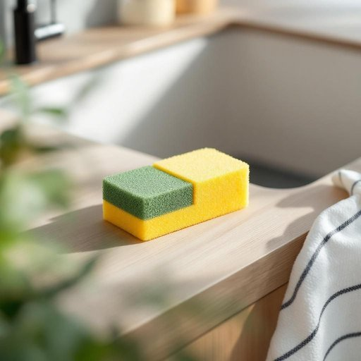

# sponge

<h1 style="font-size: 2.5em; font-weight: 300; letter-spacing: 2px; margin: 0; color: #2c3e50;">
/spənʤ/
</h1>

---

---

## 例句

Could you please hand me the sponge that's sitting next to the sink, the one with the green scrubbing side and the yellow foam, because I need to clean the stubborn grease off the frying pan before it hardens and becomes impossible to remove?

*Could(/kʊd/) you(/ju/) please(/pliz/) hand(/hænd/) me(/mi/) the(/ðə/) sponge(/spənʤ/) that's(/ðæts/) sitting(/ˈsɪtɪŋ/) next(/nɛkst/) to(/tɪ/) the(/ðə/) sink,(/sɪŋk,/) the(/ðə/) one(/wən/) with(/wɪθ/) the(/ðə/) green(/grin/) scrubbing(/ˈskrəbɪŋ/) side(/saɪd/) and(/ənd/) the(/ðə/) yellow(/ˈjɛloʊ/) foam,(/foʊm,/) because(/bɪˈkəz/) I(/aɪ/) need(/nid/) to(/tɪ/) clean(/klin/) the(/ðə/) stubborn(/ˈstəbərn/) grease(/gris/) off(/ɔf/) the(/ðə/) frying(/fraɪɪŋ/) pan(/pæn/) before(/ˌbiˈfɔr/) it(/ɪt/) hardens(/ˈhɑrdənz/) and(/ənd/) becomes(/bɪˈkəmz/) impossible(/ˌɪmˈpɑsəbəl/) to(/tɪ/) remove?(/riˈmuv?/)*

**翻译：** 请把放在水槽旁边的那个海绵递给我，就是带绿色清洁面和黄色泡沫的那块，因为我需要在油渍变干变难清除之前把煎锅上的顽固油渍清理干净。

---

## 解释

英语单词"sponge"作为名词，在家居生活用品的语境中指的是一种多孔、多吸水性的清洁用具，通常由天然海绵或合成材料制成，主要用于洗碗、擦拭台面或清洁各种表面。具体使用场合常见于厨房、浴室或清洁工作中，如“kitchen sponge”（厨房海绵）、“cleaning sponge”（清洁海绵）等表达。英语学习者需要注意，"sponge"作为可数名词，一般用复数形式"sponges"表示多个海绵，且常与介词短语连用，如"wet the sponge"（弄湿海绵）、"use a sponge to clean"（用海绵清洁），在表达中常搭配动词"to soak"（浸湿）和形容词"soft"（柔软的）等。此外，"sponge"也有动词用法，意味着“揩油，寄生”，但在家居用品语境中仅作名词使用。该词源自古英语"spong"和拉丁语"spongia"，最初指海中自然生成的海绵生物，后来引申为用于清洁的物品。在中文语境中，常准确翻译为“海绵”或“清洁海绵”，意指那种多孔且能够吸水的清洁工具，需避免混淆为生物学概念中的“海绵动物”。总体而言，"sponge"作为生活用品名词中立，无褒贬色彩，文化上普遍被视为日常必需的清洁辅助工具。

---

<small style="color: #999; font-size: 0.9em;">2025-07-27 09:14:04</small>

