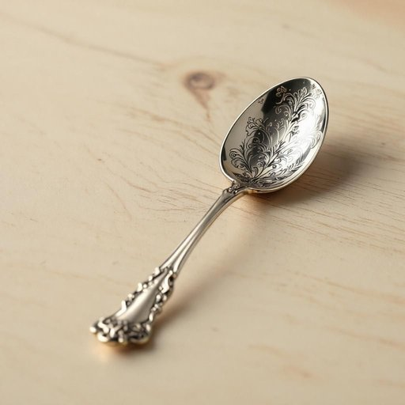

# spoon

<h1 style="font-size: 2.5em; font-weight: 300; letter-spacing: 2px; margin: 0; color: #2c3e50;">
/spun/
</h1>

---

---

## 例句

The spoon on the table, which was crafted in the eighteenth century and has intricate engravings, is considered a valuable antique by collectors all over the world.

*The(/ðə/) spoon(/spun/) on(/ɔn/) the(/ðə/) table,(/ˈteɪbəl,/) which(/wɪʧ/) was(/wɑz/) crafted(/ˈkræftɪd/) in(/ɪn/) the(/ðə/) eighteenth(/ˈeɪˈtinθ/) century(/ˈsɛnʧəri/) and(/ənd/) has(/həz/) intricate(/ˈɪntrəkət/) engravings,(/ɪnˈgreɪvɪŋz,/) is(/ɪz/) considered(/kənˈsɪdərd/) a(/ə/) valuable(/ˈvæljəbəl/) antique(/ænˈtik/) by(/baɪ/) collectors(/kəˈlɛktərz/) all(/ɔl/) over(/ˈoʊvər/) the(/ðə/) world.(/wərld./)*

**翻译：** 桌上的那把勺子雕工精细，铸于十八世纪，被全球收藏家视为珍贵的古董。

---

## 解释

英语单词“spoon”作为名词在家居生活用品的语境中，主要指一种用来舀取、盛放或搅拌液体或半固体食物的餐具，通常由金属、塑料或木材制成，形状具有一个凹状的勺头和相连的柄。具体使用场合包括吃汤、咖啡、糖、冰淇淋或调料，也常见于烹饪和摆餐桌时。学习者在使用“spoon”时应注意其单复数形式“spoons”，在表示“一只勺子”时用不定冠词“a spoon”，在表达某种动作时常与动词连用，如“use a spoon”“stir with a spoon”等，此外还有常见搭配如“teaspoon”（茶匙）、“tablespoon”（大汤勺）及短语“spoonful of”（一勺的量）。词源方面，“spoon”源自中古英语“spoon”，继承自古英语“spōn”，意指由木片制成的小勺，最早反映该物品由天然木材制成的历史背景。中文中“spoon”一般精确翻译为“勺子”，在口语和书面语中均可使用，能准确表示该餐具，且无褒贬或特殊文化色彩，属于中性词汇，表示日常生活中非常常见且实用的餐具之一。

---

<small style="color: #999; font-size: 0.9em;">2025-07-27 09:14:04</small>

