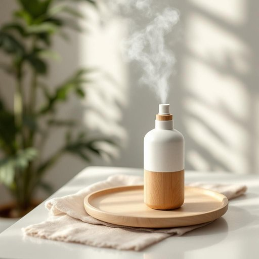

# spray

<h1 style="font-size: 2.5em; font-weight: 300; letter-spacing: 2px; margin: 0; color: #2c3e50;">
/spreɪ/
</h1>

---

---

## 例句

The complexity of the project required the team to devise a comprehensive plan that not only addressed the technical challenges but also ensured timely communication with stakeholders to maintain trust and facilitate smooth execution.

*The(/ðə/) complexity(/kəmˈplɛksɪti/) of(/əv/) the(/ðə/) project(/ˈprɑʤɛkt/) required(/rikˈwaɪərd/) the(/ðə/) team(/tim/) to(/tɪ/) devise(/dɪˈvaɪz/) a(/ə/) comprehensive(/ˌkɑmpriˈhɛnsɪv/) plan(/plæn/) that(/ðət/) not(/nɑt/) only(/ˈoʊnli/) addressed(/əˈdrɛst/) the(/ðə/) technical(/ˈtɛknɪkəl/) challenges(/ˈʧælənʤɪz/) but(/bət/) also(/ˈɔlsoʊ/) ensured(/ɪnˈʃʊrd/) timely(/ˈtaɪmli/) communication(/kəmˌjunəˈkeɪʃən/) with(/wɪθ/) stakeholders(/ˈsteɪˌkhoʊldərz/) to(/tɪ/) maintain(/meɪnˈteɪn/) trust(/trəst/) and(/ənd/) facilitate(/fəˈsɪləˌteɪt/) smooth(/smuð/) execution.(/ˌɛksəˈkjuʃən./)*

**翻译：** 项目的复杂性要求团队制定一项全面的计划，该计划不仅要应对技术挑战，还需确保与相关方的及时沟通，以维护信任并促进顺利执行。

---

## 解释

英语单词“spray”作为名词在家居生活用品的语境中，通常指喷雾状的液体或喷雾瓶，具体使用场合包括空气清新剂喷雾、清洁剂喷雾、消毒喷雾或者植物喷雾器中喷出的液体。这些“spray”一般是容器内通过压力或气泵形成细小液滴，方便均匀喷洒。英语学习者需要注意，“spray”作为名词是不可数或可数名词，视具体指代的物品而定，如“a spray of perfume”（一喷香水）或“some spray”（一些喷雾），且与动词“to spray”（喷洒）相关联，常见搭配有“a spray bottle”（喷雾瓶）、“a spray can”（喷罐）、“air freshener spray”（空气清新剂喷雾）等，表达时常强调喷出的液体状态及其用途。该词源于中古英语“sprayen”，意为喷射细流，古法语“espraier”亦有喷射之意，反映了其形象化的物理动作。中文中“spray”一般译为“喷雾”、“喷雾剂”或“喷雾瓶”，强调的是通过喷射形成的细密液体，准确理解时应结合其具体用途，如消毒喷雾对应“消毒喷雾剂”，避免误解为单纯的液体或其他物形容词。该词在家居生活语境中无褒贬色彩，属于中性词汇，文化内涵主要与现代生活中便利与卫生相关，反映了现代家居用品对空气质量及清洁便捷性的关注。

---

<small style="color: #999; font-size: 0.9em;">2025-07-27 09:14:04</small>

