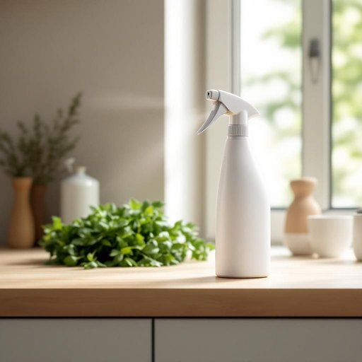

# sprayer

<h1 style="font-size: 2.5em; font-weight: 300; letter-spacing: 2px; margin: 0; color: #2c3e50;">
/spreɪər/
</h1>

---

---

## 例句

Could you please pass me the sprayer that’s usually kept under the kitchen sink, the one with the adjustable nozzle which allows you to switch between a fine mist and a powerful jet, because I need to water the herbs by the window without drenching the countertop or splashing the freshly polished floor?

*Could(/kʊd/) you(/ju/) please(/pliz/) pass(/pæs/) me(/mi/) the(/ðə/) sprayer(/spreɪər/) that’s(/that’s*/) usually(/ˈjuʒəwəli/) kept(/kɛpt/) under(/ˈəndər/) the(/ðə/) kitchen(/ˈkɪʧən/) sink,(/sɪŋk,/) the(/ðə/) one(/wən/) with(/wɪθ/) the(/ðə/) adjustable(/əˈʤəstəbəl/) nozzle(/ˈnɑzəl/) which(/wɪʧ/) allows(/əˈlaʊz/) you(/ju/) to(/tɪ/) switch(/swɪʧ/) between(/bɪtˈwin/) a(/ə/) fine(/faɪn/) mist(/mɪst/) and(/ənd/) a(/ə/) powerful(/ˈpaʊərfəl/) jet,(/ʤɛt,/) because(/bɪˈkəz/) I(/aɪ/) need(/nid/) to(/tɪ/) water(/ˈwɔtər/) the(/ðə/) herbs(/ərbz/) by(/baɪ/) the(/ðə/) window(/ˈwɪndoʊ/) without(/wɪˈθaʊt/) drenching(/ˈdrɛnʧɪŋ/) the(/ðə/) countertop(/ˈkaʊntərˌtɑp/) or(/ər/) splashing(/ˈsplæʃɪŋ/) the(/ðə/) freshly(/ˈfrɛʃli/) polished(/ˈpɑlɪʃt/) floor?(/flɔr?/)*

**翻译：** 你能把通常放在厨房水槽下的那个喷雾器递给我吗？就是那个带有可调喷嘴的，可以在细雾和强力喷射之间切换的喷雾器，因为我需要给窗边的香草浇水，但又不想弄湿台面或溅到刚擦亮的地板上。

---

## 解释

英语单词“sprayer”作为名词，在家居生活用品的语境中通常指用于喷洒液体的工具，如喷壶、喷雾器或喷瓶，常见于园艺浇花、清洁消毒或美容护肤产品的包装中，使用场合多为家庭内部或花园中需要均匀喷洒水、清洁剂或其他液体的场景。学习者在使用“sprayer”时应注意其作为可数名词的语法属性，通常与冠词（a sprayer）或数量短语连用，且常见固定搭配包括“garden sprayer”（园艺喷壶）、“chemical sprayer”（化学喷雾器）等；此外，“sprayer”不宜与表示人称的动词直接搭配，应指物品或设备而非行为执行者。词源方面，“sprayer”由动词“spray”（喷洒）加上名词后缀“-er”构成，表示“喷洒液体的工具或装置”，反映其功能性起源。中文语境中，“sprayer”准确翻译为“喷壶”、“喷雾器”或“喷瓶”，依具体用途而定，常用于描述家庭园艺、清洁工具或化妆喷雾容器。此词一般无褒贬色彩，属于中性实用词汇，没有特殊文化内涵，使用时主要注意根据具体液体性质和使用环境选择合适的喷雾工具名称，从而准确传达其功能和用途。

---

<small style="color: #999; font-size: 0.9em;">2025-07-27 09:14:04</small>

