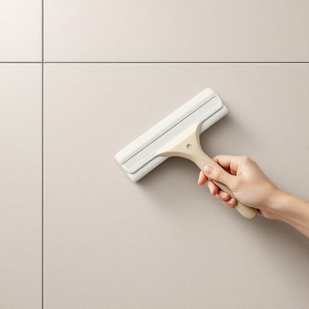

# squeegee

<h1 style="font-size: 2.5em; font-weight: 300; letter-spacing: 2px; margin: 0; color: #2c3e50;">
/skˈwiʤi/
</h1>

---

---

## 例句

After struggling to get the steamed-up bathroom mirror clear, she finally reached for the squeegee, which, with its sturdy rubber blade and comfortable handle, proved indispensable not only for wiping down glass surfaces without leaving streaks but also for quickly removing excess water from the tiled walls, ensuring the whole room stayed dry and mould-free.

*After(/ˈæftər/) struggling(/ˈstrəgəlɪŋ/) to(/tɪ/) get(/gɪt/) the(/ðə/) steamed-up(/steamed-up*/) bathroom(/ˈbæθˌrum/) mirror(/ˈmɪrər/) clear,(/klɪr,/) she(/ʃi/) finally(/ˈfaɪnəli/) reached(/riʧt/) for(/fər/) the(/ðə/) squeegee,(/skˈwiʤi,/) which,(/wɪʧ,/) with(/wɪθ/) its(/ɪts/) sturdy(/ˈstərdi/) rubber(/ˈrəbər/) blade(/bleɪd/) and(/ənd/) comfortable(/ˈkəmfərtəbəl/) handle,(/ˈhændəl,/) proved(/pruvd/) indispensable(/ˌɪndɪˈspɛnsəbəl/) not(/nɑt/) only(/ˈoʊnli/) for(/fər/) wiping(/ˈwaɪpɪŋ/) down(/daʊn/) glass(/glæs/) surfaces(/ˈsərfəsɪz/) without(/wɪˈθaʊt/) leaving(/ˈlivɪŋ/) streaks(/striks/) but(/bət/) also(/ˈɔlsoʊ/) for(/fər/) quickly(/kˈwɪkli/) removing(/riˈmuvɪŋ/) excess(/ˈɛkˌsɛs/) water(/ˈwɔtər/) from(/frəm/) the(/ðə/) tiled(/taɪld/) walls,(/wɔlz,/) ensuring(/ɪnˈʃʊrɪŋ/) the(/ðə/) whole(/hoʊl/) room(/rum/) stayed(/steɪd/) dry(/draɪ/) and(/ənd/) mould-free.(/mould-free*./)*

**翻译：** 她费力地想要擦干起雾的浴室镜子，最终拿起了刮水器。那刮水器配备了坚固的橡胶刃和舒适的手柄，不仅在擦拭玻璃表面时不会留下水痕，还能迅速清除瓷砖墙上的多余水分，确保整个房间保持干燥，无霉变。

---

## 解释

英语单词"squeegee"作为名词，在家居生活用品的语境中指的是一种带有橡胶条的清洁工具，用于刮擦玻璃、瓷砖、浴室镜子或窗户上的水分和污渍，帮助快速去除水渍和保持表面清洁。具体使用场合通常是在清洁浴室玻璃门、窗户或地面时，尤其适合去水后的表面处理，常见于日常家务和专业清洁工作。学习者需要注意的是，"squeegee"作为名词通常单数形式使用，复数形式为"squeegees"，且该词本身是可数名词。常见搭配包括"squeegee blade"（刮水条）、"use a squeegee"（使用刮水器）等表达方式。此外，"to squeegee"也有动词形式，表示用刮水器刮净的动作，这一点需要区分。词源上，"squeegee"起源于19世纪末的英语，可能来源于拟声词“squeeze”变形，反映了滚动或挤压动作，最初用于描述通过橡胶条挤压水分的操作。中文中，"squeegee"准确翻译为“刮水器”或“橡胶刮”，强调其功能性和材质，常见于家居清洁用具分类，没有褒贬色彩，也无特殊文化内涵，是一个中性且实用的词汇。

---

<small style="color: #999; font-size: 0.9em;">2025-07-27 09:14:04</small>

