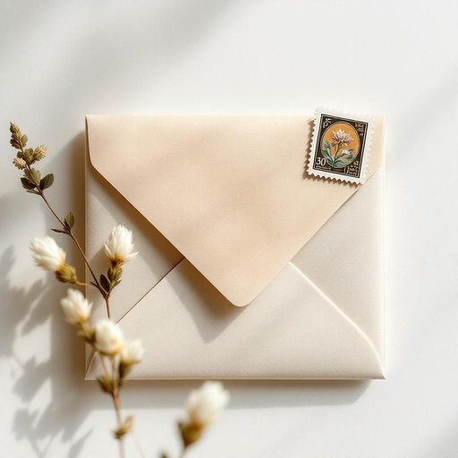

# stamp

<h1 style="font-size: 2.5em; font-weight: 300; letter-spacing: 2px; margin: 0; color: #2c3e50;">
/stæmp/
</h1>

---

---

## 例句

Could you please check if we have any more stamp sheets left in the drawer, since I need to post this parcel before the post office closes, and without the correct stamp, it simply won’t be accepted?

*Could(/kʊd/) you(/ju/) please(/pliz/) check(/ʧɛk/) if(/ɪf/) we(/wi/) have(/hæv/) any(/ˈɛni/) more(/mɔr/) stamp(/stæmp/) sheets(/ʃits/) left(/lɛft/) in(/ɪn/) the(/ðə/) drawer,(/drɔr,/) since(/sɪns/) I(/aɪ/) need(/nid/) to(/tɪ/) post(/poʊst/) this(/ðɪs/) parcel(/ˈpɑrsəl/) before(/ˌbiˈfɔr/) the(/ðə/) post(/poʊst/) office(/ˈɔfəs/) closes,(/ˈkloʊzɪz,/) and(/ənd/) without(/wɪˈθaʊt/) the(/ðə/) correct(/kərˈɛkt/) stamp,(/stæmp,/) it(/ɪt/) simply(/ˈsɪmpli/) won’t(/won’t*/) be(/bi/) accepted?(/ækˈsɛptɪd?/)*

**翻译：** 请帮我看看抽屉里是否还有邮票纸，因为我需要在邮局关闭前寄出这个包裹，没有合适的邮票，包裹是无法被接收的。

---

## 解释

英语单词stamp作为名词在家居生活用品的语境中，通常指邮票，是用于邮件上的一种小纸片，表示已支付邮资，常见于家庭的信件寄送过程中，或者收集和保存邮票的爱好场合。使用时要注意，stamp作为名词时是可数的，复数形式为stamps，常见搭配有postage stamp（邮资邮票）、stamp collection（集邮册）、send a letter with a stamp（带邮票寄信）等表达。在语法上，应根据具体语境选择合适的冠词和数形式，例如a stamp表示一枚邮票，the stamp指特定邮票。stamp一词来源于中古英语，原意为用印章压印，其词根可追溯至古英语stampon，意指踩踏或压印，逐渐演变为盖章或贴邮票的含义。中文语境中，stamp作为名词最准确的翻译是邮票，无需混淆其作为动词时的踩踏或盖章含义。在家居生活用品领域，stamp没有褒贬色彩，属于中性词，但在文化层面，集邮是一项具有一定历史文化价值的爱好，体现了对邮政系统和历史的兴趣和尊重。

---

<small style="color: #999; font-size: 0.9em;">2025-07-27 09:14:04</small>

