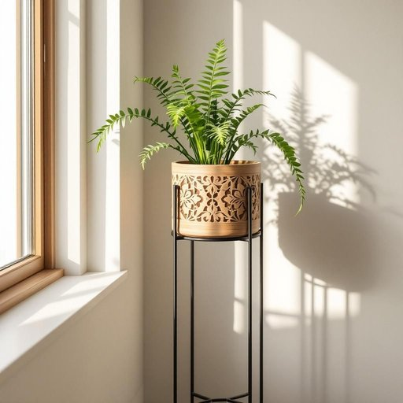

# stand

<h1 style="font-size: 2.5em; font-weight: 300; letter-spacing: 2px; margin: 0; color: #2c3e50;">
/stænd/
</h1>

---

---

## 例句

The plant stand near the window, which featured intricate wooden carvings and metal supports, served as a perfect platform for the fern that had been wilting despite frequent watering.

*The(/ðə/) plant(/plænt/) stand(/stænd/) near(/nɪr/) the(/ðə/) window,(/ˈwɪndoʊ,/) which(/wɪʧ/) featured(/ˈfiʧərd/) intricate(/ˈɪntrəkət/) wooden(/ˈwʊdən/) carvings(/ˈkɑrvɪŋz/) and(/ənd/) metal(/ˈmɛtəl/) supports,(/səˈpɔrts,/) served(/sərvd/) as(/ɛz/) a(/ə/) perfect(/ˈpərˌfɪkt/) platform(/ˈplætˌfɔrm/) for(/fər/) the(/ðə/) fern(/fərn/) that(/ðət/) had(/hæd/) been(/bɪn/) wilting(/ˈwɪltɪŋ/) despite(/dɪˈspaɪt/) frequent(/ˈfrikˌwɛnt/) watering.(/ˈwɔtərɪŋ./)*

**翻译：** 靠近窗户的植物架配有精美的木雕和金属支撑，是蕨类植物的理想摆放处，尽管频繁浇水，它依然有些枯萎。

---

## 解释

英语单词'stand'在家居生活用品的语境中作为名词，通常指“支架”、“架子”或“摆放物品用的底座”，例如电视机柜（TV stand）、花架（plant stand）、鞋架（shoe stand）等，这些“stand”主要作用是支撑、安放或展示某物，常用于描述家具或陈列用品，使用场合多见于家庭、商店、办公室等环境中。英语学习者在使用该名词时需注意，‘stand’作为名词时一般是可数名词，常用复数形式stands；此外‘stand’可以与不同的限定词或形容词搭配，如‘a TV stand’、‘a plant stand’、‘a music stand’等，表示不同用途的支架，要根据具体物品选择合适的搭配，避免模糊不清。在表达技巧上，‘stand’后的名词常作限定词，用以说明支架的用途或所承载的物品，这种结构为名词短语，较为常见且自然。词源上，‘stand’源自古英语‘standan’，意为“站立”，引申为“支撑物”或“可站立的物体”，作为名词时即指能“站立”或承载物品的架台，这是其意义的自然演变。中文语境中，‘stand’作为家居用品名词的准确翻译通常为“架子”、“支架”或“底座”，视具体功能而定，避免简单直译成“站立”，应强调其作为家具或摆设的固定支撑角色。在文化或语言色彩方面，‘stand’作为名词在家居用品领域属于中性词汇，不带褒贬或特殊情感色彩，且为日常生活中使用频率较高的实用词汇。总之，理解和使用‘stand’作为名词时应结合具体物品和场景，关注其作为可数支撑结构的属性，避免混淆其动词“站立”意义，从而准确、自然地表达家居生活中的相关概念。

---

<small style="color: #999; font-size: 0.9em;">2025-07-27 09:14:04</small>

