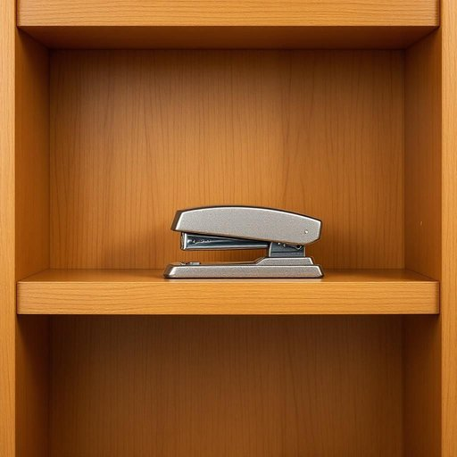

# stapler

<h1 style="font-size: 2.5em; font-weight: 300; letter-spacing: 2px; margin: 0; color: #2c3e50;">
/ˈsteɪpələr/
</h1>

---

---

## 例句

Could you please hand me the stapler that's usually kept on the second shelf of the bookcase in the study room, the one with the slightly bent metal arm that you've been meaning to fix since last month, so I can quickly bind these reports together before the postman arrives?

*Could(/kʊd/) you(/ju/) please(/pliz/) hand(/hænd/) me(/mi/) the(/ðə/) stapler(/ˈsteɪpələr/) that's(/ðæts/) usually(/ˈjuʒəwəli/) kept(/kɛpt/) on(/ɔn/) the(/ðə/) second(/ˈsɛkənd/) shelf(/ʃɛlf/) of(/əv/) the(/ðə/) bookcase(/ˈbʊkˌkeɪs/) in(/ɪn/) the(/ðə/) study(/ˈstədi/) room,(/rum,/) the(/ðə/) one(/wən/) with(/wɪθ/) the(/ðə/) slightly(/sˈlaɪtli/) bent(/bɛnt/) metal(/ˈmɛtəl/) arm(/ɑrm/) that(/ðət/) you've(/juv/) been(/bɪn/) meaning(/ˈminɪŋ/) to(/tɪ/) fix(/fɪks/) since(/sɪns/) last(/læst/) month,(/mənθ,/) so(/soʊ/) I(/aɪ/) can(/kən/) quickly(/kˈwɪkli/) bind(/baɪnd/) these(/ðiz/) reports(/rɪˈpɔrts/) together(/təˈgɛðər/) before(/ˌbiˈfɔr/) the(/ðə/) postman(/ˈpoʊstmən/) arrives?(/əraɪvz?/)*

**翻译：** 你能把书房书柜第二层架子上那个订书机递给我吗？就是那个金属臂稍微有点弯，你从上个月就一直想修好的那个，我想趁快递员来之前赶紧把这些报告订起来。

---

## 解释

“stapler”作为名词在家居生活用品的语境中指的是一种用来将纸张或其他轻薄材料通过金属订书针固定在一起的工具常见于家庭办公或学校场合用于整理文件制作手工艺品等英语学习者使用该词时应注意它是可数名词通常前面可加不定冠词a复数形式为staplers常见搭配有a stapler and staples（订书机和订书针）electric/manual stapler（电动/手动订书机）等此外stapler一般作为具体物品称谓出现不用于抽象概念词源上stapler来自staple的名词形式（订书针）加上表示工具的后缀erstaple本身源自古英语stapol意指支柱或钉子后发展为现代意义的订书钉中文语境中stapler准确翻译为订书机这个词在普通家庭及办公环境中使用频率较高且没有褒贬色彩或特殊文化内涵是一种非常中性且实用的工具名称

---

<small style="color: #999; font-size: 0.9em;">2025-07-27 09:14:04</small>

