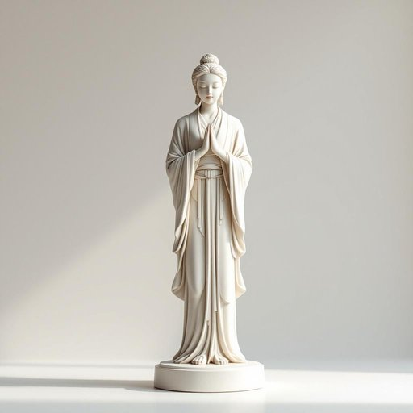

# statue

<h1 style="font-size: 2.5em; font-weight: 300; letter-spacing: 2px; margin: 0; color: #2c3e50;">
/ˈstæˌʧu/
</h1>

---

---

## 例句

The statue, standing proudly in the bustling art gallery, attracts numerous visitors who admire its intricate details and the artist’s masterful craftsmanship amid the vibrant cultural scene.

*The(/ðə/) statue,(/ˈstæˌʧu,/) standing(/ˈstændɪŋ/) proudly(/ˈpraʊdli/) in(/ɪn/) the(/ðə/) bustling(/ˈbəsəlɪŋ/) art(/ɑrt/) gallery,(/ˈgæləri,/) attracts(/əˈtrækts/) numerous(/ˈnumərəs/) visitors(/ˈvɪzɪtərz/) who(/hu/) admire(/ædˈmaɪr/) its(/ɪts/) intricate(/ˈɪntrəkət/) details(/ˈditeɪlz/) and(/ənd/) the(/ðə/) artist’s(/artist’s*/) masterful(/ˈmæstərfəl/) craftsmanship(/ˈkræftsmənˌʃɪp/) amid(/əˈmɪd/) the(/ðə/) vibrant(/ˈvaɪbrənt/) cultural(/ˈkəlʧərəl/) scene.(/sin./)*

**翻译：** 这座雕像庄重矗立在熙熙攘攘的艺术画廊中，吸引了众多游客，他们在充满活力的文化氛围中赞叹其精致的细节和艺术家高超的技艺。

---

## 解释

英语单词“statue”作为名词，指的是用石头、金属、木材等材料雕刻或铸造的人像或物体形象，常作为装饰品或纪念物。在家居生活用品的语境中，“statue”通常指摆放在室内或庭院中的装饰雕塑，既可以是艺术品也可以增添空间美感，例如花园中的雕像、小型台座雕塑或客厅里的艺术摆件。使用时需注意“statue”是可数名词，常与冠词连用，如“a statue”或复数形式“statues”，且常见搭配包括“garden statue”（花园雕像）、“bronze statue”（铜制雕像）、“marble statue”（大理石雕像）等。此外，“statue”与动词“carve”（雕刻）、“install”（安装）常连用。该词源自拉丁语“statua”，意为“立着的形象”，经法语传入英语，反映了其作为立体雕塑的本质。在中文中，“statue”准确译为“雕像”或“塑像”，强调其立体且具艺术或纪念意义的特征，区别于“图片”或“装饰品”中非立体形态的物件。该词无明显褒贬含义，但在文化层面上，雕像往往象征尊重、纪念或艺术价值，使用时需根据具体背景判断其文化内涵和象征意义。

---

<small style="color: #999; font-size: 0.9em;">2025-07-27 09:14:04</small>

