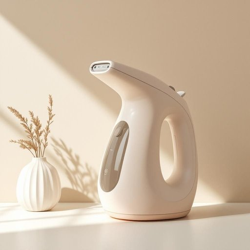

# steamer

<h1 style="font-size: 2.5em; font-weight: 300; letter-spacing: 2px; margin: 0; color: #2c3e50;">
/ˈstimər/
</h1>

---

---

## 例句

After the prolonged negotiation, the committee’s decision, influenced by a myriad of factors including public opinion and expert testimony, ultimately reflected the complex balance between economic growth and environmental preservation.

*After(/ˈæftər/) the(/ðə/) prolonged(/prəˈlɔŋd/) negotiation,(/nɪˌgoʊʃiˈeɪʃən,/) the(/ðə/) committee’s(/committee’s*/) decision,(/dɪˈsɪʒən,/) influenced(/ˈɪnfluənst/) by(/baɪ/) a(/ə/) myriad(/ˈmɪriəd/) of(/əv/) factors(/ˈfæktərz/) including(/ˌɪnˈkludɪŋ/) public(/ˈpəblɪk/) opinion(/əˈpɪnjən/) and(/ənd/) expert(/ˈɛkspərt/) testimony,(/ˈtɛstɪˌmoʊni,/) ultimately(/ˈəltəmətli/) reflected(/rɪˈflɛktɪd/) the(/ðə/) complex(/ˈkɑmplɛks/) balance(/ˈbæləns/) between(/bɪtˈwin/) economic(/ˌɛkəˈnɑmɪk/) growth(/groʊθ/) and(/ənd/) environmental(/ɪnˌvaɪrənˈmɛnəl/) preservation.(/ˌprɛzərˈveɪʃən./)*

**翻译：** 经过长时间的谈判，委员会的决定在公众舆论和专家证词等诸多因素的影响下，最终体现了经济发展与环境保护之间的复杂平衡。

---

## 解释

英语单词steamer作为名词在家居生活用品的语境中，通常指的是用来蒸汽加热或蒸汽清洁的器具，如蒸汽熨斗、衣物蒸汽挂烫机或厨房用来蒸煮食物的小型蒸锅等，具体使用场合多见于衣物护理或厨房烹饪，如用steamer去除衣物皱褶或用steamer蒸制蔬菜，学习者需要注意的是，steamer作为可数名词，在用法上遵循一般名词的单复数变化规则（单数steamer，复数steamers），且常与动词use（使用）、buy（购买）、clean（清洁）等搭配，表达时可用短语如a garment steamer（衣物蒸汽机）、a food steamer（食物蒸锅）来具体说明用途，词源方面，steamer源自英文steam（蒸汽）加上名词后缀er，原意指产生或利用蒸汽的装置，这与工业革命时期蒸汽机械的兴起有关，后来引申至家用小电器，中文语境中，steamer通常准确译为蒸汽机或蒸锅，在衣物护理领域多译为蒸汽熨斗或挂烫机，根据具体用途有所区别，该词本身无褒贬色彩，属于中性词汇，文化内涵较少，但反映出现代家庭对简便高效清洁和烹饪设备的需求，总体而言，理解steamer时应结合具体家居用品的功能和使用场合，以确保正确和自然的表达。

---

<small style="color: #999; font-size: 0.9em;">2025-07-27 09:14:04</small>

