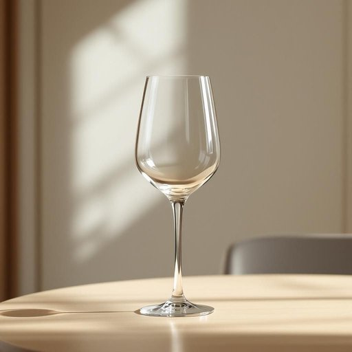

# stemware

<h1 style="font-size: 2.5em; font-weight: 300; letter-spacing: 2px; margin: 0; color: #2c3e50;">
/stemware*/
</h1>

---

---

## 例句

Despite the initial setback in the project timeline, the team's unwavering dedication and innovative problem-solving skills transformed the challenge into a valuable learning experience that ultimately enriched the collaborative spirit and productivity of the entire department.

*Despite(/dɪˈspaɪt/) the(/ðə/) initial(/ˌɪˈnɪʃəl/) setback(/ˈsɛtˌbæk/) in(/ɪn/) the(/ðə/) project(/ˈprɑʤɛkt/) timeline,(/ˈtaɪmlaɪn,/) the(/ðə/) team's(/timz/) unwavering(/ənˈweɪvərɪŋ/) dedication(/ˌdɛdəˈkeɪʃən/) and(/ənd/) innovative(/ˈɪnəˌveɪtɪv/) problem-solving(/problem-solving*/) skills(/skɪlz/) transformed(/trænsˈfɔrmd/) the(/ðə/) challenge(/ˈʧælənʤ/) into(/ˈɪntu/) a(/ə/) valuable(/ˈvæljəbəl/) learning(/ˈlərnɪŋ/) experience(/ɪkˈspɪriəns/) that(/ðət/) ultimately(/ˈəltəmətli/) enriched(/ɛnˈrɪʧt/) the(/ðə/) collaborative(/kəˈlæbərˌeɪtɪv/) spirit(/ˈspɪrɪt/) and(/ənd/) productivity(/ˌproʊdəkˈtɪvɪti/) of(/əv/) the(/ðə/) entire(/ɪnˈtaɪər/) department.(/dɪˈpɑrtmənt./)*

**翻译：** 尽管项目进度最初遭遇挫折，团队坚韧不拔的奉献精神和创新的问题解决能力，将这一挑战转化为宝贵的学习经历，最终提升了整个部门的合作氛围与工作效率。

---

## 解释

英语单词“stemware”在家居生活用品领域作为名词，指的是带有细长柄部的酒杯类器皿，常见于饮用葡萄酒、香槟、鸡尾酒等场合，通常包括红酒杯、白酒杯、高脚杯等，使用场合多为正式聚会、宴会、餐厅或家庭用酒时的餐桌布置。英语学习者在使用“stemware”时要注意该词是不可数名词，表示一类带柄酒杯，不用于复数形式；其常见搭配有“set of stemware”（一套餐具）、“crystal stemware”（水晶高脚杯）等，表达时多用于泛指或集合形式，且多与饮酒相关的场景搭配。词源上，“stemware”由“stem”（柄）与“ware”（器皿）组合而成，直指这类器皿的结构特征，即具有明显杯柄的酒杯，源于酒器设计上的分类方式。中文语境中，“stemware”准确翻译为“高脚酒杯”或“带脚酒具”，强调其杯具带有细长脚柄的特色；在日常使用或家居用品领域常用“高脚杯”一词，且该词无特殊褒贬含义，属于中性词汇，强调的是实用与美观兼具的餐饮器具，体现一定的用餐礼仪与生活品味，没有特殊文化内涵或情感色彩。

---

<small style="color: #999; font-size: 0.9em;">2025-07-27 09:14:04</small>

