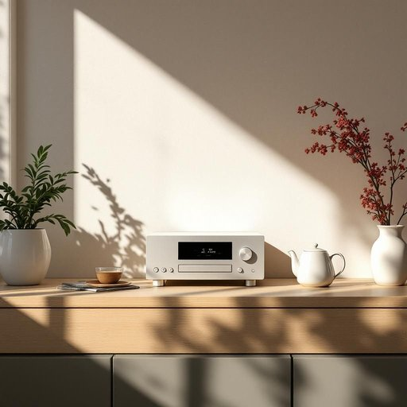

# stereo

<h1 style="font-size: 2.5em; font-weight: 300; letter-spacing: 2px; margin: 0; color: #2c3e50;">
/ˈstɛriˌoʊ/
</h1>

---

---

## 例句

Whenever I prepare a cup of tea in the kitchen, the teapot's elegant design and efficient spout ensure a smooth pour, enhancing the overall experience of relaxation and comfort in my cozy home.

*Whenever(/wɛˈnɛvər/) I(/aɪ/) prepare(/priˈpɛr/) a(/ə/) cup(/kəp/) of(/əv/) tea(/ti/) in(/ɪn/) the(/ðə/) kitchen,(/ˈkɪʧən,/) the(/ðə/) teapot's(/teapot's*/) elegant(/ˈɛləgənt/) design(/dɪˈzaɪn/) and(/ənd/) efficient(/ɪˈfɪʃənt/) spout(/spaʊt/) ensure(/ɪnˈʃʊr/) a(/ə/) smooth(/smuð/) pour,(/pɔr,/) enhancing(/ɛnˈhænsɪŋ/) the(/ðə/) overall(/ˈoʊvərˌɔl/) experience(/ɪkˈspɪriəns/) of(/əv/) relaxation(/ˌrilækˈseɪʃən/) and(/ənd/) comfort(/ˈkəmfərt/) in(/ɪn/) my(/maɪ/) cozy(/ˈkoʊzi/) home.(/hoʊm./)*

**翻译：** 每当我在厨房泡一杯茶，茶壶优雅的设计和流畅的壶嘴总能确保倒茶顺畅，增添了我温馨家中放松与舒适的整体体验。

---

## 解释

英语单词“stereo”作为名词，在家居生活用品场景中通常指的是一种音响设备，即立体声音响系统，用于播放音乐或其他音频，能够产生左右声道的立体声效果，提供更丰富的听觉体验。具体使用场合多见于家庭客厅、卧室或娱乐空间，当人们谈及“turn on the stereo”（打开音响）、“buy a new stereo”（买一个新的音响系统）或“listen to music on the stereo”（用音响听音乐）时，都属于常见语境。英语学习者在使用该词时应注意，作为名词时通常不需复数形式（尽管有复数“stereos”用于指多个音响设备），且通常与动词如“play”、“turn on”，“buy”等搭配使用，常见表达还有“stereo system”（立体声系统）、“stereo sound”（立体声）、“stereo speaker”（立体声音箱）等，体现其音响设备属性。词源方面，“stereo”源自希腊语“stereos”，意为“立体的、坚固的”，19世纪后期因声学技术发展，指代“立体声”的音响技术，强调音频空间感；因此其起源与声学和物理空间感知相关。中文语境中“stereo”准确译为“立体声音响”或“立体声设备”，在家居生活中即指家庭用的音响系统，不同于简单的“音响”或“扬声器”，强调其立体声效果和设备整体性。该词本身无明显褒贬含义，但因现代便携和数字音频设备的发展，传统“stereo”有时会带有稍显传统或复古的文化印象。总体而言，理解“stereo”应结合其音响设备属性和立体声技术背景，在家居生活用品语境中明确其作为名词的指代对象和使用习惯。

---

<small style="color: #999; font-size: 0.9em;">2025-07-27 09:14:04</small>

