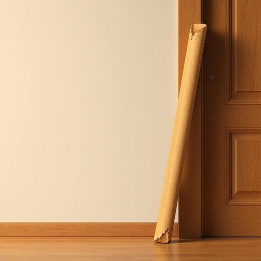

# stick

<h1 style="font-size: 2.5em; font-weight: 300; letter-spacing: 2px; margin: 0; color: #2c3e50;">
/stɪk/
</h1>

---

---

## 例句

Could you please pass me that long wooden stick leaning against the doorframe, the one with the slightly chipped end, since I need it to prop open the back window and prevent it from slamming shut every time the wind blows strongly?

*Could(/kʊd/) you(/ju/) please(/pliz/) pass(/pæs/) me(/mi/) that(/ðət/) long(/lɔŋ/) wooden(/ˈwʊdən/) stick(/stɪk/) leaning(/ˈlinɪŋ/) against(/əˈgɛnst/) the(/ðə/) doorframe,(/doorframe*,/) the(/ðə/) one(/wən/) with(/wɪθ/) the(/ðə/) slightly(/sˈlaɪtli/) chipped(/ʧɪpt/) end,(/ɛnd,/) since(/sɪns/) I(/aɪ/) need(/nid/) it(/ɪt/) to(/tɪ/) prop(/prɑp/) open(/ˈoʊpən/) the(/ðə/) back(/bæk/) window(/ˈwɪndoʊ/) and(/ənd/) prevent(/prɪˈvɛnt/) it(/ɪt/) from(/frəm/) slamming(/sˈlæmɪŋ/) shut(/ʃət/) every(/ˈɛvəri/) time(/taɪm/) the(/ðə/) wind(/wɪnd/) blows(/bloʊz/) strongly?(/ˈstrɔŋli?/)*

**翻译：** 请你把靠在门框上的那根长长的木棍递给我，就是那个末端稍微有些破损的，因为我需要它来撑开后窗，避免大风吹来时窗户猛然关上。

---

## 解释

英语单词“stick”作为名词在家居生活用品的语境中，通常指一根细长的木棍或条状物，常见于厨房用具、装饰品或日常生活中，例如“一根黄油”、“一支香体膏”或“晾衣杆”。学习者在使用“stick”时应注意其单数可表示具体的物品单个单位，复数“sticks”则指多根。此外，常见搭配包括“a stick of”加不可数名词表示计量单位，或与形容词连用如“一根长棍子”。作为名词时，“stick”多作可数名词，需注意搭配的量词和上下文语境。词源方面，“stick”源自古英语“sticca”，意指细小的木棍或刺，反映其作为木质细条的基本含义。在中文语境中，“stick”通常翻译为“棍子”、“枝条”、“棒”、“条”等，具体翻译需结合实际物品属性和用法进行调整。需注意的是，“stick”在生活用品语境中一般中性无褒贬意义，但在口语中有时可引申为“棒状物”以外的含义，如“stick to”（坚持），使用时需区分词性和语境。整体上，“stick”作为名词在家居生活领域表示具体物理形态的条状物，理解准确、搭配得当有助于表达清晰自然。

---

<small style="color: #999; font-size: 0.9em;">2025-07-27 09:14:04</small>

