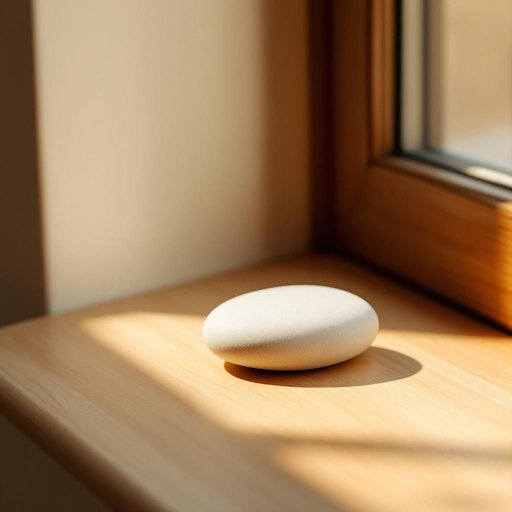

# stone

<h1 style="font-size: 2.5em; font-weight: 300; letter-spacing: 2px; margin: 0; color: #2c3e50;">
/stoʊn/
</h1>

---

---

## 例句

Could you please pass me that smooth, flat stone from the garden, the one we've been using as a makeshift paperweight on the cluttered kitchen windowsill, since I need something sturdy to prop open the door while we're carrying in the shopping?

*Could(/kʊd/) you(/ju/) please(/pliz/) pass(/pæs/) me(/mi/) that(/ðət/) smooth,(/smuð,/) flat(/flæt/) stone(/stoʊn/) from(/frəm/) the(/ðə/) garden,(/ˈgɑrdən,/) the(/ðə/) one(/wən/) we've(/wiv/) been(/bɪn/) using(/ˈjuzɪŋ/) as(/ɛz/) a(/ə/) makeshift(/ˈmeɪkˌʃɪft/) paperweight(/ˈpeɪpərˌweɪt/) on(/ɔn/) the(/ðə/) cluttered(/ˈklətərd/) kitchen(/ˈkɪʧən/) windowsill,(/windowsill*,/) since(/sɪns/) I(/aɪ/) need(/nid/) something(/ˈsəmθɪŋ/) sturdy(/ˈstərdi/) to(/tɪ/) prop(/prɑp/) open(/ˈoʊpən/) the(/ðə/) door(/dɔr/) while(/waɪl/) we're(/wɪr/) carrying(/ˈkɛriɪŋ/) in(/ɪn/) the(/ðə/) shopping?(/ˈʃɑpɪŋ?/)*

**翻译：** 你能把花园里那块光滑平整的石头递给我吗？就是我们一直用来当临时镇纸，放在杂乱的厨房窗台上的那块。我需要一块坚固的东西来顶住门，以便我们搬入购物袋时门能保持敞开。

---

## 解释

英语单词stone作为名词，在家居生活用品的语境中通常指用来制作或装饰家具、台面、地板和其他家居物品的天然石材，如大理石、大理石板、花岗岩等。具体使用场合包括厨房的石质台面、卫浴中的石材瓷砖或庭院中的石板路等，这些都是以stone命名的实物。在语法方面，stone是可数名词，复数形式为stones，但当特指建筑或雕刻用的石材时，有时也可作为不可数名词使用，英语学习者应注意区分；此外，常见搭配有stone countertop（石质台面）、stone tile（石质瓷砖）、stone floor（石质地板）等，使用时要注意与材料性质或用途相关的限定词和复数形式。词源上，stone源自古英语stān，与德语Stein和荷兰语steen同源，均意指坚硬的矿物质块体，体现了这一词汇的基础意义。中文语境中，stone多译作“石头”或“石材”，强调其自然硬质矿物的特性，在家居用品语境下更侧重于“石材”作为一种建筑与装饰材料的正式译法，无特殊褒贬色彩，但在文化内涵上，石材因其坚固耐用常象征稳定和品质，因此在高端家居设计中具有一定象征意义。

---

<small style="color: #999; font-size: 0.9em;">2025-07-27 09:14:04</small>

