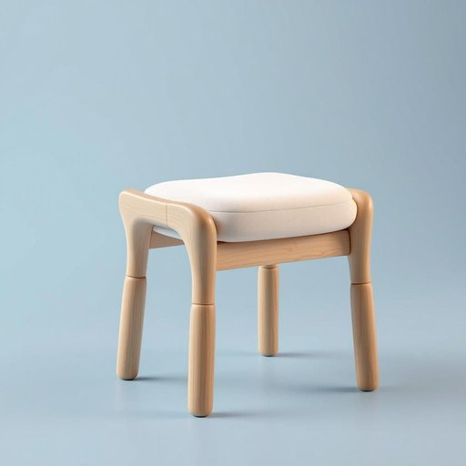

# stool

<h1 style="font-size: 2.5em; font-weight: 300; letter-spacing: 2px; margin: 0; color: #2c3e50;">
/stul/
</h1>

---

---

## 例句

Could you please bring the small wooden stool from the kitchen, the one with the cushioned seat that grandmother painted last summer, so I can sit down comfortably while I finish assembling the new bookshelf in the living room?

*Could(/kʊd/) you(/ju/) please(/pliz/) bring(/brɪŋ/) the(/ðə/) small(/smɔl/) wooden(/ˈwʊdən/) stool(/stul/) from(/frəm/) the(/ðə/) kitchen,(/ˈkɪʧən,/) the(/ðə/) one(/wən/) with(/wɪθ/) the(/ðə/) cushioned(/ˈkʊʃənd/) seat(/sit/) that(/ðət/) grandmother(/ˈgrændˌməðər/) painted(/ˈpeɪnɪd/) last(/læst/) summer,(/ˈsəmər,/) so(/soʊ/) I(/aɪ/) can(/kən/) sit(/sɪt/) down(/daʊn/) comfortably(/ˈkəmfərtəbli/) while(/waɪl/) I(/aɪ/) finish(/ˈfɪnɪʃ/) assembling(/əˈsɛmbəlɪŋ/) the(/ðə/) new(/nu/) bookshelf(/ˈbʊkˌʃɛlf/) in(/ɪn/) the(/ðə/) living(/ˈlɪvɪŋ/) room?(/rum?/)*

**翻译：** 您能否帮我从厨房拿来那把小木凳，就是带软垫座椅、去年夏天奶奶亲手粉刷的那把？这样我在客厅组装新书架时，能舒舒服服地坐着。

---

## 解释

英语单词“stool”作为名词在家居生活用品的语境中，通常指无靠背、没有扶手的矮凳或小凳子，常用于厨房、酒吧、化妆台旁等场所，方便人们短时坐下或作为辅助家具使用。使用“stool”时，英语学习者需要注意其为可数名词，复数形式为“stools”，常见搭配有“一把木凳”（a wooden stool）、“酒吧凳”（a bar stool）、“厨房凳”（a kitchen stool）等，表达时多用不定冠词a/an或指示代词this/that。词源上，“stool”源自古英语“stol”，意为座位、长凳，反映了其作为坐具的历史渊源。需要特别指出的是，“stool”在英语中还有别的含义，如医学上的“粪便”，但在家居用品语境下应避免混淆。中文语境中，“stool”一般准确翻译为“凳子”或“小凳”，强调其简便、小巧且无靠背的特征。该词本身无褒贬含义，但根据具体场合不同，使用时应结合上下文以避免误解。在学习和使用过程中，理解其专指简易坐具的意义，有助于准确表达和理解相关家居生活场景。

---

<small style="color: #999; font-size: 0.9em;">2025-07-27 09:14:04</small>

