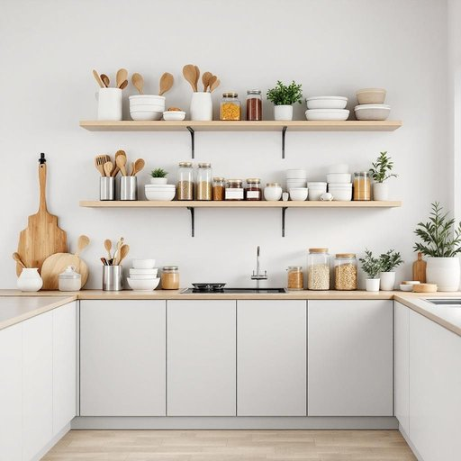

# storage

<h1 style="font-size: 2.5em; font-weight: 300; letter-spacing: 2px; margin: 0; color: #2c3e50;">
/ˈstɔrɪʤ/
</h1>

---

---

## 例句

With the limited storage available in the kitchen cupboards, which are already packed with cookware, spices, and dry goods, the storage situation has become increasingly challenging, so we really need to consider adding some clever shelving units or perhaps invest in stackable storage boxes to keep everything organised and easily accessible.

*With(/wɪθ/) the(/ðə/) limited(/ˈlɪmɪtɪd/) storage(/ˈstɔrɪʤ/) available(/əˈveɪləbəl/) in(/ɪn/) the(/ðə/) kitchen(/ˈkɪʧən/) cupboards,(/ˈkəbərdz,/) which(/wɪʧ/) are(/ər/) already(/ɔˈrɛdi/) packed(/pækt/) with(/wɪθ/) cookware,(/ˈkʊkˌwɛr,/) spices,(/ˈspaɪsɪz,/) and(/ənd/) dry(/draɪ/) goods,(/gʊdz,/) the(/ðə/) storage(/ˈstɔrɪʤ/) situation(/ˌsɪʧuˈeɪʃən/) has(/həz/) become(/bɪˈkəm/) increasingly(/ˌɪnˈkrisɪŋgli/) challenging,(/ˈʧælənʤɪŋ,/) so(/soʊ/) we(/wi/) really(/ˈrɪli/) need(/nid/) to(/tɪ/) consider(/kənˈsɪdər/) adding(/ˈædɪŋ/) some(/səm/) clever(/ˈklɛvər/) shelving(/ˈʃɛlvɪŋ/) units(/ˈjunɪts/) or(/ər/) perhaps(/pərˈhæps/) invest(/ˌɪnˈvɛst/) in(/ɪn/) stackable(/stackable*/) storage(/ˈstɔrɪʤ/) boxes(/ˈbɑksɪz/) to(/tɪ/) keep(/kip/) everything(/ˈɛvriˌθɪŋ/) organised(/organised*/) and(/ənd/) easily(/ˈizəli/) accessible.(/ækˈsɛsəbəl./)*

**翻译：** 由于厨房橱柜的储物空间有限，而橱柜内已经塞满了炊具、香料和干货，存储状况变得愈发困难，因此我们确实需要考虑增设一些巧妙的搁架，或许还可以投资购买可叠放的储物盒，以保持物品的整齐有序和便于取用。

---

## 解释

英语单词“storage”作为名词，在家居生活用品的语境中通常指的是“存储空间”或“储藏设施”，即用于放置或保存物品的地方，如储物柜、储藏室、收纳盒等。具体使用场合包括描述房屋内用于放置物品的区域，比如说“kitchen storage”（厨房储藏空间）、“closet storage”（衣橱存储）或“storage unit”（存储单元）。英语学习者在使用“storage”时要注意，它通常为不可数名词，表示存储的概念或容量，因此一般不用复数形式，但在特定语境如“storage units”时可表示具体的存储单元。此外，“storage”常与表示位置、容量或功能的词搭配，如“ample storage”（充足的存储空间）、“additional storage”（额外的存储空间）等，有助于准确表达具体需求。词源方面，“storage”起源于中古英语，源自古法语“estorage”，意为“贮藏”，最终追溯到拉丁语“staurare”，含义为“坚持、固定”，体现了储存物品的稳定性与保存功能。在中文语境中，“storage”一般翻译为“储藏”、“存储”或“储物空间”，强调物品的收纳和整理功能，无明显褒贬色彩，属于中性词汇，反映了家庭生活中空间利用和物品管理的重要方面。

---

<small style="color: #999; font-size: 0.9em;">2025-07-27 09:14:04</small>

