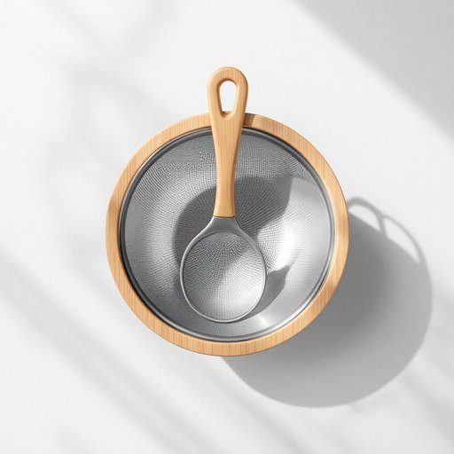

# strainer

<h1 style="font-size: 2.5em; font-weight: 300; letter-spacing: 2px; margin: 0; color: #2c3e50;">
/strainer*/
</h1>

---

---

## 例句

After rinsing the pasta thoroughly, could you please pass me the strainer that we bought last month, the one with the fine mesh and sturdy handle, so I can drain the water without losing any of the sauce?

*After(/ˈæftər/) rinsing(/ˈrɪnsɪŋ/) the(/ðə/) pasta(/ˈpɑstə/) thoroughly,(/ˈθəroʊli,/) could(/kʊd/) you(/ju/) please(/pliz/) pass(/pæs/) me(/mi/) the(/ðə/) strainer(/strainer*/) that(/ðət/) we(/wi/) bought(/bɔt/) last(/læst/) month,(/mənθ,/) the(/ðə/) one(/wən/) with(/wɪθ/) the(/ðə/) fine(/faɪn/) mesh(/mɛʃ/) and(/ənd/) sturdy(/ˈstərdi/) handle,(/ˈhændəl,/) so(/soʊ/) I(/aɪ/) can(/kən/) drain(/dreɪn/) the(/ðə/) water(/ˈwɔtər/) without(/wɪˈθaʊt/) losing(/ˈluzɪŋ/) any(/ˈɛni/) of(/əv/) the(/ðə/) sauce?(/sɔs?/)*

**翻译：** 在彻底冲洗意大利面后，能请你递给我上个月买的那个滤网吗？就是那个细密网眼且手柄结实的，这样我就能在滤水时不漏掉任何酱汁。

---

## 解释

单词strainer在家居生活用品的语境中作为名词，主要指的是“滤器”或“过滤器”，通常用于厨房或浴室，指用来过滤固体杂质或水垢的工具，比如过滤水中的杂质，或者放置在水槽、管道中防止残渣堵塞的过滤网。具体使用场合通常是描述厨房用具或水管配件时，比如sink strainer（水槽滤器）常用于防止食物残渣进入下水道。英语学习者使用该词时需注意，strainer为可数名词，可在前面加冠词a/an/the或复数形式strainers，且常与介词短语连用描述具体位置，如in the sink、for the tea等。此外，它常与动词搭配使用，如use a strainer、clean the strainer等。词源方面，strainer来自动词strain，意指过滤、滤出，由中世纪英语演变而来，根源于拉丁语stringere（拉紧、挤压），体现了通过施加压力从液体中过滤固体的功能。中文中，该词精准的翻译为“滤器”或“滤网”，根据具体物品不同亦可译作“滤筛”或“过滤器”，一般无褒贬含义，属于中性词汇，功能性描述明确，无特殊文化内涵或情感色彩。总的来说，strainer在家居用品语境中指代实用且常见的过滤用具，是厨房和浴室防堵塞、净化液体的关键工具。

---

<small style="color: #999; font-size: 0.9em;">2025-07-27 09:14:04</small>

