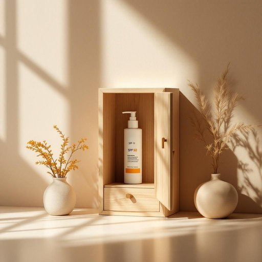

# sunscreen

<h1 style="font-size: 2.5em; font-weight: 300; letter-spacing: 2px; margin: 0; color: #2c3e50;">
/ˈsənskrin/
</h1>

---

---

## 例句

Before we head out to the garden this afternoon, could you please check the bathroom cabinet for the sunscreen we bought last summer, the one with SPF 50 that not only protects against UVB rays but also contains antioxidants to help prevent skin damage?

*Before(/ˌbiˈfɔr/) we(/wi/) head(/hɛd/) out(/aʊt/) to(/tɪ/) the(/ðə/) garden(/ˈgɑrdən/) this(/ðɪs/) afternoon,(/ˌæftərˈnun,/) could(/kʊd/) you(/ju/) please(/pliz/) check(/ʧɛk/) the(/ðə/) bathroom(/ˈbæθˌrum/) cabinet(/ˈkæbənət/) for(/fər/) the(/ðə/) sunscreen(/ˈsənskrin/) we(/wi/) bought(/bɔt/) last(/læst/) summer,(/ˈsəmər,/) the(/ðə/) one(/wən/) with(/wɪθ/) SPF(/spf*/) 50(/50/) that(/ðət/) not(/nɑt/) only(/ˈoʊnli/) protects(/prəˈtɛkts/) against(/əˈgɛnst/) UVB(/uvb*/) rays(/reɪz/) but(/bət/) also(/ˈɔlsoʊ/) contains(/kənˈteɪnz/) antioxidants(/ˌæntiˈɑksədənts/) to(/tɪ/) help(/hɛlp/) prevent(/prɪˈvɛnt/) skin(/skɪn/) damage?(/ˈdæmɪʤ?/)*

**翻译：** 下午我们去花园之前，请帮忙检查一下浴室柜里的防晒霜，那是去年夏天买的，具有50倍防晒指数，不仅能抵御紫外线B，还含有抗氧化成分，有助于防止皮肤损伤。

---

## 解释

英语单词"sunscreen"作为名词，指的是防晒霜或防晒乳，是一种用于保护皮肤免受紫外线伤害的护肤产品，常见于家居生活用品中，尤其是在阳光强烈的季节或户外活动前使用。具体使用场合包括日常外出、海滩、户外运动等，需要防止晒伤或长期紫外线损害的情景。英语学习者在使用该词时应注意，"sunscreen"是不可数名词，通常不用复数形式，但在非正式或口语中偶尔听到"sunscreens"指不同品牌或类型的防晒霜。此外，常见的搭配有"apply sunscreen"（涂抹防晒霜）、"broad-spectrum sunscreen"（广谱防晒霜）、"water-resistant sunscreen"（防水防晒霜）等，这些表达帮助描述防晒霜的功能和使用方法。词源方面，"sunscreen"由"suns"（太阳的复数形式，这里实际上表示“太阳”）和"screen"（屏障、挡板）组合而成，字面意思是“遮挡太阳的物质”，体现了其防护功能。中文中准确翻译为“防晒霜”，强调其化妆品和护肤品性质。需要注意的是，"sunscreen"一般不含特殊褒贬意义，属于中性词汇，因其关系到健康和美容，有着积极的文化内涵，体现现代人注重防晒和皮肤保健的生活态度。

---

<small style="color: #999; font-size: 0.9em;">2025-07-27 09:14:04</small>

