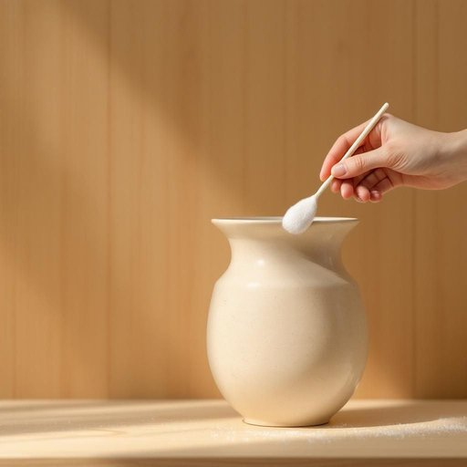

# swab

<h1 style="font-size: 2.5em; font-weight: 300; letter-spacing: 2px; margin: 0; color: #2c3e50;">
/swɑb/
</h1>

---

---

## 例句

Before you clean the delicate surface of the antique vase, make sure to use a sterile swab dipped in diluted detergent, as this will help avoid any scratches or residue that a cloth might leave behind.

*Before(/ˌbiˈfɔr/) you(/ju/) clean(/klin/) the(/ðə/) delicate(/ˈdɛləkət/) surface(/ˈsərfəs/) of(/əv/) the(/ðə/) antique(/ænˈtik/) vase,(/vɑz,/) make(/meɪk/) sure(/ʃʊr/) to(/tɪ/) use(/juz/) a(/ə/) sterile(/ˈstɛrəl/) swab(/swɑb/) dipped(/dɪpt/) in(/ɪn/) diluted(/dɪˈlutəd/) detergent,(/dɪˈtərʤənt,/) as(/ɛz/) this(/ðɪs/) will(/wɪl/) help(/hɛlp/) avoid(/əˈvɔɪd/) any(/ˈɛni/) scratches(/ˈskræʧɪz/) or(/ər/) residue(/ˈrɛzəˌdu/) that(/ðət/) a(/ə/) cloth(/klɔθ/) might(/maɪt/) leave(/liv/) behind.(/bɪˈhaɪnd./)*

**翻译：** 在清洁古董花瓶的精致表面之前，请务必使用蘸有稀释洗涤剂的无菌棉签清洁，这样能有效避免布料可能留下的划痕或残留物。

---

## 解释

英语单词“swab”作为名词在家居生活用品场景中通常指的是用于擦拭、清洁或采样的小棉签或拭子，常见于清洁伤口、化妆、护理或消毒过程中。具体使用时，如“cotton swab”常指那种两头带有棉花的小棒，家庭中常用来清理耳朵边缘、涂抹药物等。英语学习者使用“swab”时需注意其名词形式通常是单数或复数“swabs”，且常与介词“with”或“for”连用，如“clean with a swab”或“take a swab for testing”。此外，“swab”作为名词时一般特指医用或清洁用的小棉签，不宜用于泛指其他任何棍状物品。词源上，“swab”源自17世纪早期的荷兰语“swabben”，意为擦拭，这与其清洁用具的属性相符。在中文语境中，“swab”准确翻译为“棉签”或“拭子”，根据具体用途可译为“消毒棉签”、“采样拭子”等，体现其功能性与材料特征。该词无明显褒贬色彩，属于中性词，主要用以描述实用工具，没有特殊的文化内涵或隐喻意义。

---

<small style="color: #999; font-size: 0.9em;">2025-07-27 09:14:04</small>

