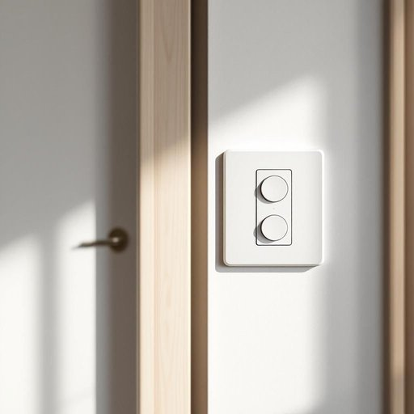

# switch

<h1 style="font-size: 2.5em; font-weight: 300; letter-spacing: 2px; margin: 0; color: #2c3e50;">
/swɪʧ/
</h1>

---

---

## 例句

Could you please check the switch by the front door, which controls both the hallway and living room lights, to see if it’s faulty or simply needs tightening, as it’s been flickering on and off whenever someone walks past?

*Could(/kʊd/) you(/ju/) please(/pliz/) check(/ʧɛk/) the(/ðə/) switch(/swɪʧ/) by(/baɪ/) the(/ðə/) front(/frənt/) door,(/dɔr,/) which(/wɪʧ/) controls(/kənˈtroʊlz/) both(/boʊθ/) the(/ðə/) hallway(/ˈhɔlˌweɪ/) and(/ənd/) living(/ˈlɪvɪŋ/) room(/rum/) lights,(/laɪts,/) to(/tɪ/) see(/si/) if(/ɪf/) it’s(/it’s*/) faulty(/ˈfɔlti/) or(/ər/) simply(/ˈsɪmpli/) needs(/nidz/) tightening,(/ˈtaɪtənɪŋ,/) as(/ɛz/) it’s(/it’s*/) been(/bɪn/) flickering(/ˈflɪkərɪŋ/) on(/ɔn/) and(/ənd/) off(/ɔf/) whenever(/wɛˈnɛvər/) someone(/ˈsəmˌwən/) walks(/wɔks/) past?(/pæst?/)*

**翻译：** 请您帮忙检查一下前门旁的开关，该开关控制着走廊和客厅的灯，看看它是否损坏，还是只是需要拧紧，因为每当有人经过时，灯就会时有时无地闪烁。

---

## 解释

英语单词“switch”在家居生活用品语境中作为名词，通常指“开关”，即用于控制电器设备电流通断的装置，常见于灯具、家用电器等场合。使用时，多见搭配如“light switch”（灯开关）、“power switch”（电源开关）、“wall switch”（墙壁开关），学习者应注意“switch”作为可数名词时需根据单复数形式变化，如“一开关”a switch，“多个开关”switches。语法上，“switch”常与介词“on”或“off”搭配，表示开或关，例如“turn the switch on/off”，需要掌握正确的动词搭配表达行为。词源方面，“switch”源自古英语“swiccian”，意为快速打击或转动，后引申为切换或转变，体现了开关操作的动作含义。在中文语境中，“switch”作为名词最准确的对应词是“开关”，强调其机械或电子装置属性，避免与“转变”“切换”等抽象意义混淆。总的来说，该词在此语境中无褒贬色彩，属于中性技术用词，使用时重点在于准确理解其物理功能及相关固定搭配，从而正确应用于描述家居电气控制场景。

---

<small style="color: #999; font-size: 0.9em;">2025-07-27 09:14:04</small>

