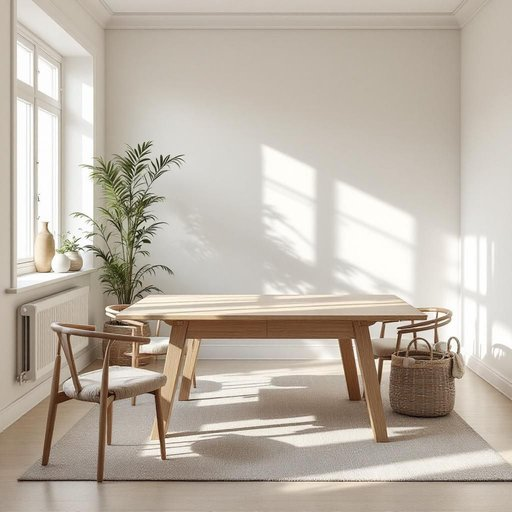

# table

<h1 style="font-size: 2.5em; font-weight: 300; letter-spacing: 2px; margin: 0; color: #2c3e50;">
/ˈteɪbəl/
</h1>

---

---

## 例句

Could you please clear the table in the dining room, where we usually enjoy our evening meals together, before I bring out the board games that are perfect for a family night in?

*Could(/kʊd/) you(/ju/) please(/pliz/) clear(/klɪr/) the(/ðə/) table(/ˈteɪbəl/) in(/ɪn/) the(/ðə/) dining(/ˈdaɪnɪŋ/) room,(/rum,/) where(/wɛr/) we(/wi/) usually(/ˈjuʒəwəli/) enjoy(/ˌɛnˈʤɔɪ/) our(/ɑr/) evening(/ˈivnɪŋ/) meals(/milz/) together,(/təˈgɛðər,/) before(/ˌbiˈfɔr/) I(/aɪ/) bring(/brɪŋ/) out(/aʊt/) the(/ðə/) board(/bɔrd/) games(/geɪmz/) that(/ðət/) are(/ər/) perfect(/ˈpərˌfɪkt/) for(/fər/) a(/ə/) family(/ˈfæməli/) night(/naɪt/) in?(/ɪn?/)*

**翻译：** 请你先把餐厅的桌子收拾一下，那是我们平时一起享用晚餐的地方，待会儿我拿出适合家庭夜晚娱乐的棋盘游戏。

---

## 解释

英语单词“table”作为名词在家居生活用品的语境中，通常指供人放置物品、吃饭、工作或摆设的平面家具，多为四腿支撑，材质多样如木质、金属或玻璃。具体使用场合包括餐厅中的餐桌、客厅的茶几、书房的书桌等，常用语境涉及家庭生活、饮食、学习和社交活动。英语学习者在使用“table”时应注意它是可数名词，复数形式为“tables”，且常见搭配有“dining table”（餐桌）、“coffee table”（茶几）、“study table”（书桌）等，表达注意区分不同功能的桌子；此外，“set the table”表示“摆桌子”，是常用短语。词源方面，“table”来源于拉丁语“tabula”，意为“板子”或“桌面”，经过古法语“table”传入英语，延续其基本含义而演变至今日，体现家具的平面结构特征。中文语境中，“table”准确翻译为“桌子”或“台子”，根据具体功能可细分如“餐桌”、“书桌”，指代明确且无褒贬色彩，属中性词汇，文化内涵普遍且直接，反映日常生活的重要家具元素，使用时需根据具体情境确定合适的中文对应词以确保表达准确。

---

<small style="color: #999; font-size: 0.9em;">2025-07-27 09:14:04</small>

