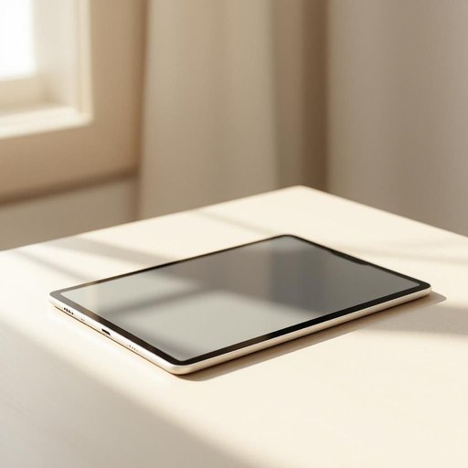

# tablet

<h1 style="font-size: 2.5em; font-weight: 300; letter-spacing: 2px; margin: 0; color: #2c3e50;">
/ˈtæblət/
</h1>

---

---

## 例句

I couldn’t believe it when she mentioned the tablet as the perfect gift idea during our hectic conversation about holiday shopping, especially since mine had just stopped working after months of careful use and updating all the apps I rely on for work.

*I(/aɪ/) couldn’t(/couldn’t*/) believe(/bɪˈliv/) it(/ɪt/) when(/wɪn/) she(/ʃi/) mentioned(/ˈmɛnʃənd/) the(/ðə/) tablet(/ˈtæblət/) as(/ɛz/) the(/ðə/) perfect(/ˈpərˌfɪkt/) gift(/gɪft/) idea(/aɪˈdiə/) during(/ˈdʊrɪŋ/) our(/ɑr/) hectic(/ˈhɛktɪk/) conversation(/ˌkɑnvərˈseɪʃən/) about(/əˈbaʊt/) holiday(/ˈhɑlɪˌdeɪ/) shopping,(/ˈʃɑpɪŋ,/) especially(/əˈspɛʃəli/) since(/sɪns/) mine(/maɪn/) had(/hæd/) just(/ʤɪst/) stopped(/stɑpt/) working(/ˈwərkɪŋ/) after(/ˈæftər/) months(/mənθs/) of(/əv/) careful(/ˈkɛrfəl/) use(/juz/) and(/ənd/) updating(/ˈəpˌdeɪtɪŋ/) all(/ɔl/) the(/ðə/) apps(/æps/) I(/aɪ/) rely(/rɪˈlaɪ/) on(/ɔn/) for(/fər/) work.(/wərk./)*

**翻译：** 当她在我们关于假日购物的忙碌谈话中提到平板电脑是最完美的礼物创意时，我简直不敢相信，尤其是因为我的平板在经过数月的细心使用和不断更新我工作所依赖的各种应用后刚刚坏了。

---

## 解释

英语单词tablet在家居生活用品的语境中作为名词，主要指一种扁平的小块物品，最常见的使用场合包括药品如药片、洗衣或洗碗用的固体剂型如洗涤片，以及电子设备如平板电脑等，但在传统家居用品中更多指片剂或小块固体。英语学习者在使用tablet时需注意其复数形式为tablets，常见搭配有aspirin tablet（阿司匹林片）、detergent tablet（洗涤片）等，此外当tablet指电子产品时一般无冠词或常与a连用如a tablet，而指药片或洗涤片时需根据数量选择冠词，语法上属可数名词。词源方面，tablet源自拉丁语tabula，意为平板、匾额，后来引申为平坦的小块，体现了其物理形态特征。中文语境中，tablet应准确翻译为药片、片剂、平板电脑或洗衣小块视具体语境而定，特别在家居生活用品类别内，多指药片或洗涤片，强调其形态和用途。该词无特殊褒贬色彩，属于中性词汇，但需注意不要与table桌子混淆。

---

<small style="color: #999; font-size: 0.9em;">2025-07-27 09:14:04</small>

