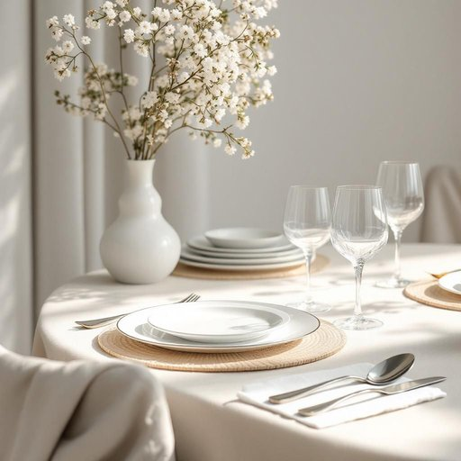

# tableware

<h1 style="font-size: 2.5em; font-weight: 300; letter-spacing: 2px; margin: 0; color: #2c3e50;">
/ˈteɪbəlˌwɛr/
</h1>

---

---

## 例句

Before setting the dining table for tonight’s dinner party, could you please unpack the new tableware, which includes the elegant porcelain plates, polished cutlery, and delicate crystal glasses, ensuring everything is spotless and arranged precisely as per the hostess’s instructions?

*Before(/ˌbiˈfɔr/) setting(/ˈsɛtɪŋ/) the(/ðə/) dining(/ˈdaɪnɪŋ/) table(/ˈteɪbəl/) for(/fər/) tonight’s(/tonight’s*/) dinner(/ˈdɪnər/) party,(/ˈpɑrti,/) could(/kʊd/) you(/ju/) please(/pliz/) unpack(/ənˈpæk/) the(/ðə/) new(/nu/) tableware,(/ˈteɪbəlˌwɛr,/) which(/wɪʧ/) includes(/ˌɪnˈkludz/) the(/ðə/) elegant(/ˈɛləgənt/) porcelain(/ˈpɔrsələn/) plates,(/pleɪts,/) polished(/ˈpɑlɪʃt/) cutlery,(/ˈkətləri,/) and(/ənd/) delicate(/ˈdɛləkət/) crystal(/ˈkrɪstəl/) glasses,(/ˈglæsɪz,/) ensuring(/ɪnˈʃʊrɪŋ/) everything(/ˈɛvriˌθɪŋ/) is(/ɪz/) spotless(/ˈspɑtləs/) and(/ənd/) arranged(/əreɪnʤd/) precisely(/prɪˈsaɪsli/) as(/ɛz/) per(/pər/) the(/ðə/) hostess’s(/hostess’s*/) instructions?(/ˌɪnˈstrəkʃənz?/)*

**翻译：** 在为今晚的晚宴摆放餐具之前，能否请你先拆开新餐具，包括精致的瓷盘、光亮的餐具以及纤巧的水晶杯，确保所有物品洁净无瑕，并按照女主人指示的摆放要求准确摆放？

---

## 解释

英语单词tableware作为名词，主要指用于餐桌上的各类用具，包括盘子、碗、杯子、刀叉勺及其他餐具，常见于描述家居生活中餐饮相关的场合，如家庭用餐、餐厅布置或宴会准备等。英语学习者使用该词时需注意，tableware是不可数名词，通常不直接加复数形式，而是用具体类别或数量词来限定，如pieces of tableware或sets of tableware；常见搭配有set of tableware（一套餐具）、fine tableware（精美餐具）等，且多用作集合名词整体指代一套餐具。同时，tableware多用于正式或日常语境中，与cutlery（刀具）、dinnerware（餐具，侧重盘碗）等词汇有细微区别，避免混淆其指代范围。该词源于table（桌子）和ware（器皿、物品）组合而成，起源于古英语和中古英语中对器物的统称，强调使用场合为餐桌之上的物品。从中文语境来看，tableware准确翻译为餐具或餐桌用具，涵盖范围较广，不仅限于刀叉勺，也包括碗碟杯等，区别于餐具中侧重刀叉勺的cutlery或餐饮用具的更大范畴。该词本身无褒贬色彩，属于中性词汇，文化内涵体现为西方及国际餐饮文化中对餐桌布置和礼仪的关注，学习时应了解其应用场合多为正式用餐或日常餐厅环境，在描述家居生活用品时具有较明确且统一的指代意义。

---

<small style="color: #999; font-size: 0.9em;">2025-07-27 09:14:04</small>

