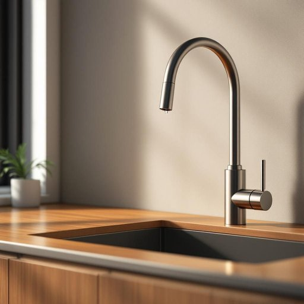

# tap

<h1 style="font-size: 2.5em; font-weight: 300; letter-spacing: 2px; margin: 0; color: #2c3e50;">
/tæp/
</h1>

---

---

## 例句

Could you please tighten the tap in the kitchen sink, which has been dripping steadily since the plumber left this morning, because if it continues, not only will it waste a significant amount of water, but it might also cause dampness on the wooden cabinet underneath, leading to potential damage that we’d rather avoid?

*Could(/kʊd/) you(/ju/) please(/pliz/) tighten(/ˈtaɪtən/) the(/ðə/) tap(/tæp/) in(/ɪn/) the(/ðə/) kitchen(/ˈkɪʧən/) sink,(/sɪŋk,/) which(/wɪʧ/) has(/həz/) been(/bɪn/) dripping(/ˈdrɪpɪŋ/) steadily(/ˈstɛdəli/) since(/sɪns/) the(/ðə/) plumber(/ˈpləmər/) left(/lɛft/) this(/ðɪs/) morning,(/ˈmɔrnɪŋ,/) because(/bɪˈkəz/) if(/ɪf/) it(/ɪt/) continues,(/kənˈtɪnjuz,/) not(/nɑt/) only(/ˈoʊnli/) will(/wɪl/) it(/ɪt/) waste(/weɪst/) a(/ə/) significant(/sɪgˈnɪfɪkənt/) amount(/əˈmaʊnt/) of(/əv/) water,(/ˈwɔtər,/) but(/bət/) it(/ɪt/) might(/maɪt/) also(/ˈɔlsoʊ/) cause(/kɔz/) dampness(/ˈdæmpnɪs/) on(/ɔn/) the(/ðə/) wooden(/ˈwʊdən/) cabinet(/ˈkæbənət/) underneath,(/ˌəndərˈniθ,/) leading(/ˈlidɪŋ/) to(/tɪ/) potential(/pəˈtɛnʃəl/) damage(/ˈdæmɪʤ/) that(/ðət/) we’d(/we’d*/) rather(/ˈrəðər/) avoid?(/əˈvɔɪd?/)*

**翻译：** 能否请您把厨房水槽的水龙头拧紧一下？自今晨水管工离开后，它一直在不停地滴水。如果继续这样，不仅会浪费大量水资源，还可能导致下面的木柜受潮，从而造成我们希望避免的损害。

---

## 解释

英语单词tap作为名词在家居生活用品的语境中通常指的是水龙头即用来控制水流出或停止的装置常见于厨房浴室等场合这在英国英语中尤为普遍而在美国英语中对应的词多为faucet学习者在使用tap时需注意其作为可数名词时需加冠词如a tap或特指时用the tap且常与动词搭配如turn on off the tap开关水龙头此外tap water表示未经处理的自来水是常见且固定的搭配词源方面tap起源于古英语tæpp或tæppa其根源可追溯至日耳曼语族原指木桶上的小塞子或阀门用以控制液体流出这一含义延续至今翻译上tap准确对应中文的水龙头但需区别于其他意为轻敲轻拍的tap在家居用品语境下不含贬义或特殊文化色彩单纯为日常生活中的实用器具名称学习者应根据具体语境判断其名词或动词意义避免混淆

---

<small style="color: #999; font-size: 0.9em;">2025-07-27 09:14:04</small>

